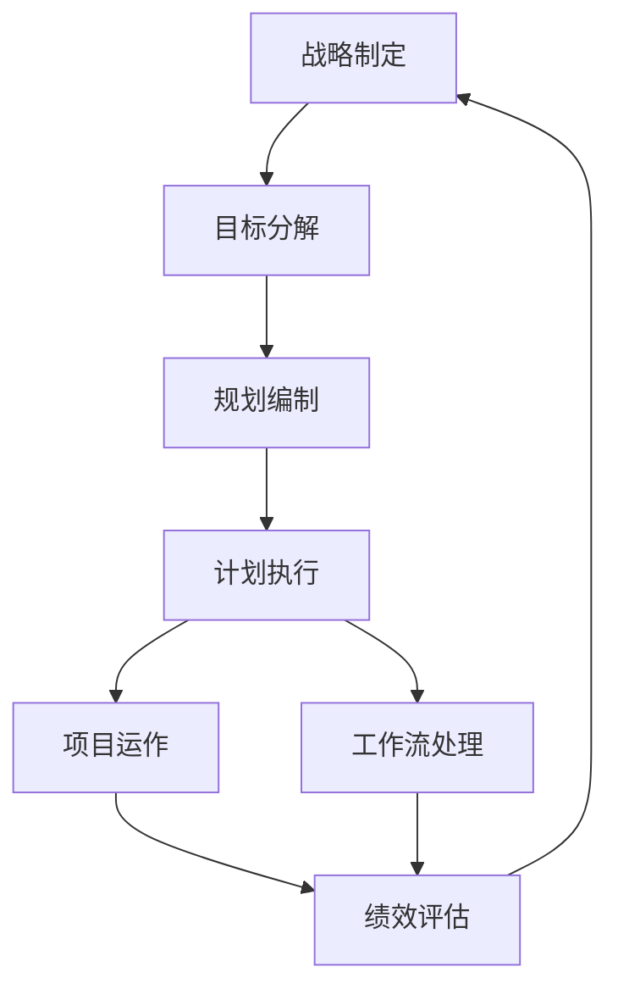

# 管理底座架构深度分析文档

## 1. 架构概述

本管理底座架构是一个**多层次、模块化**的组织管理体系，采用树状结构构建，体现了从战略规划到日常执行的完整管理闭环。架构以"管理底座"为根节点，通过四大核心支柱（部门、管理模块、运行模块、绩效模块）构建起完整的组织运营框架。

## 2. 核心架构组件

### 2.1 部门层级结构
```
管理底座
├── 部门
│   ├── 总部（战略决策中心）
│   ├── 软件（技术研发体系）
│   ├── 生产（运营执行体系）
│   └── 内务（后勤保障体系）
```

### 2.2 管理功能模块
```
管理底座
├── 管理模块
│   ├── 战略（仅总部）
│   ├── 目标
│   ├── 规划
│   └── 计划
```

### 2.3 运行执行模块
```
管理底座
├── 运行模块
│   ├── 项目
│   │   ├── 任务
│   │   ├── 议题
│   │   ├── 笔记
│   │   └── 日程
│   └── 工作流
│       ├── 任务
│       ├── 议题
│       ├── 笔记
│       └── 日程
```

### 2.4 绩效评估模块
```
管理底座
└── 绩效模块
```

## 3. 架构深度解析

### 3.1 设计理念分析

#### 3.1.1 分层治理原则
- **战略层**：总部专属，负责方向性决策
- **管理层**：目标→规划→计划的递进关系
- **执行层**：项目与工作流双轨并行
- **评估层**：绩效模块闭环反馈

#### 3.1.2 模块化设计思想
- 每个模块职责单一，边界清晰
- 模块间通过标准接口协作
- 支持按需组合和扩展

### 3.2 业务逻辑流程



### 3.3 组织运作机制

#### 3.3.1 纵向管控链条
```
战略（总部） → 目标 → 规划 → 计划 → 执行 → 绩效
```

#### 3.3.2 横向协作网络
- **项目导向**：以任务为核心的临时性工作组织
- **流程导向**：以工作流为核心的标准化操作
- **知识管理**：通过笔记和议题积累组织智慧

### 3.4 核心特征识别

#### 3.4.1 完整性特征
- 覆盖战略到执行的全流程
- 包含计划、执行、评估完整闭环
- 兼顾硬性任务和软性知识管理

#### 3.4.2 灵活性特征
- 部门级定制化（软件部门有独立的管理体系）
- 模块可组合（不同部门可配置不同模块组合）
- 粒度可调节（从战略宏观到任务微观）

#### 3.4.3 协同性特征
- 多维度协作（项目、工作流双轨制）
- 知识共享机制（笔记、议题的跨模块流转）
- 时间管理集成（日程的统一协调）

## 4. 架构价值体现

### 4.1 管理效能提升
- **清晰的责任边界**：每个模块有明确的输入输出
- **标准化的工作流程**：减少沟通成本和重复劳动
- **可视化的进度跟踪**：通过任务、议题、日程实现透明化管理

### 4.2 组织适应性
- **可扩展的架构**：支持新部门、新业务的快速接入
- **可配置的模块**：根据不同业务特点灵活调整
- **可度量的绩效**：为持续改进提供数据支撑

### 4.3 知识积累机制
- **显性知识管理**：通过笔记记录最佳实践
- **隐性知识挖掘**：通过议题讨论深度思考
- **经验传承体系**：建立组织记忆库

## 5. 实施建议

### 5.1 分阶段推进
1. **基础搭建**：先建立总部级管理模块
2. **部门扩展**：逐步推广到各业务部门
3. **深度集成**：实现跨部门协同运作

### 5.2 关键成功因素
- 高层承诺和参与
- 清晰的权责划分
- 持续的训练和支持
- 定期的体系评审

### 5.3 风险防控
- 避免过度官僚化
- 保持体系的灵活性
- 建立反馈改进机制

## 6. 总结

这个管理底座架构代表了一个**现代、科学、系统化**的组织管理体系，它既保持了传统管理的严谨性，又融入了敏捷管理的灵活性。通过模块化的设计、清晰的层次结构和完整的闭环机制，为组织提供了一个可扩展、可度量、可持续改进的管理框架。

该架构的核心价值在于将抽象的管理理念转化为具体可操作的工作模式，使战略能够有效落地，执行能够有序推进，绩效能够客观评估，最终实现组织效能的最大化。