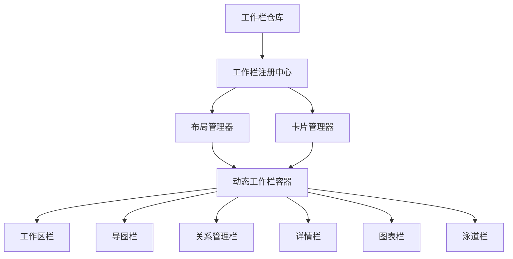
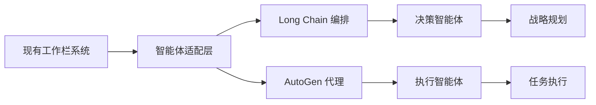

# 10-双循环管理-IT系统落地展望与技术评估

## 引言：从理论架构到技术实现

在前9个文档中，我们深入论述了双循环管理架构的理论基础、核心机制和未来展望。现在，我们基于用户描述的实际系统架构，进行技术可行性评估和落地展望。当前系统已经构建了工作栏生态系统的雏形，为双循环管理架构的落地提供了理想的技术基础。

## 一、当前系统架构深度分析

### 1.1 工作栏生态系统架构

通过对`new_prototype`目录的分析，当前系统已经构建了完整的工作栏生态系统：



### 1.2 核心技术组件

**数据层**：
- `AutogenUnifiedStorage`: 统一的存储系统
- `AutogenEventBus`: 事件总线系统
- `DependencyManager`: 依赖管理

**工作栏层**：
- `ColumnRegistry`: 工作栏注册中心
- `ColumnWarehouse`: 工作栏仓库管理
- `LayoutManager`: 动态布局管理
- `ColumnCardManager`: 卡片式界面管理

**业务层**：
- 泳道看板 (`swimlane-board.js`)
- 脑图管理
- 关系可视化
- 项目管理

## 二、与双循环管理架构的契合度分析

### 2.1 宏观循环的技术实现基础

**战略→目标→规划→计划路径**在系统中的体现：

```javascript
// 当前系统已经具备的宏观循环组件
const macroCycleComponents = {
  strategy: '脑图栏 - 战略规划可视化',
  goals: '泳道看板 - 目标分解与跟踪', 
  planning: '工作区栏 - 项目规划管理',
  execution: '关系管理栏 - 执行过程协调'
};
```

**关键发现**：当前系统的多工作栏设计天然支持宏观循环的分层管理，每个工作栏对应不同的管理层次。

### 2.2 微观循环的技术实现基础

**任务→议题→笔记→日程弥散系统**在系统中的体现：

```javascript
// 当前系统已经具备的微观循环组件
const microCycleComponents = {
  tasks: '泳道看板任务卡片',
  issues: '关系管理栏议题跟踪', 
  notes: '详情栏文档管理',
  schedules: '工作区栏时间安排'
};
```

**关键发现**：系统的模块化设计使得小循环元素可以自然地弥散到各个工作栏中。

### 2.3 关键结合点的技术实现

**项目和工作流作为结合点**的技术基础：

```javascript
// 泳道看板作为项目管理的核心结合点
const convergencePoint = {
  projectManagement: 'swimlane-board.js',
  workflowEngine: 'ColumnRegistry + EventBus',
  dataIntegration: 'AutogenUnifiedStorage',
  visualization: '多工作栏协同'
};
```

## 三、智能体系统集成可行性评估

### 3.1 Long Chain + AutoGen 技术栈分析

**当前技术基础**：
- 模块化架构支持智能体插拔
- 事件系统为智能体通信提供基础设施
- 统一存储为智能体学习提供数据基础

**集成路径**：



### 3.2 智能体弥散架构设计

**层级化智能体部署**：

```javascript
// 智能体分层部署方案
const agentLayers = {
  strategicAgents: {
    location: '脑图栏 + 图表栏',
    function: '战略分析、目标制定',
    technology: 'AutoGen + 大语言模型'
  },
  tacticalAgents: {
    location: '泳道栏 + 关系栏', 
    function: '项目规划、资源协调',
    technology: 'Long Chain + 规则引擎'
  },
  operationalAgents: {
    location: '工作区栏 + 详情栏',
    function: '任务执行、进度跟踪',
    technology: 'AutoGen + 工作流引擎'
  }
};
```

### 3.3 "点亮系统"的技术实现

**智能体激活机制**：

```javascript
class SystemIllumination {
  constructor() {
    this.agents = new Map();
    this.activationTriggers = new Set();
  }
  
  // 注册智能体到工作栏
  registerAgent(columnId, agentConfig) {
    const column = ColumnRegistry.get(columnId);
    if (column) {
      this.agents.set(columnId, {
        ...agentConfig,
        column: column,
        activated: false
      });
    }
  }
  
  // 激活智能体系统
  async illuminate() {
    for (const [columnId, agent] of this.agents) {
      await this.activateAgent(columnId, agent);
    }
    console.log('🎯 系统已被智能体点亮');
  }
  
  // 单个智能体激活
  async activateAgent(columnId, agent) {
    // 集成 Long Chain 编排
    const chain = await LongChain.create(agent.workflow);
    
    // 集成 AutoGen 代理
    const autogenAgent = await AutoGen.createAgent(agent.config);
    
    // 绑定到工作栏事件
    this.bindToColumnEvents(columnId, chain, autogenAgent);
    
    agent.activated = true;
  }
}
```

## 四、自适应与自动化机制落地展望

### 4.1 自适应探针系统实现

**基于现有架构的探针部署**：

```javascript
// 自适应探针在现有工作栏中的部署
const adaptiveProbes = {
  taskProbe: {
    location: '泳道看板',
    metrics: ['完成率', '耗时', '质量评分'],
    triggers: ['任务状态变更', '截止日期临近']
  },
  collaborationProbe: {
    location: '关系管理栏', 
    metrics: ['协作频率', '问题解决效率', '知识共享'],
    triggers: ['新议题创建', '关系变更']
  },
  learningProbe: {
    location: '详情栏',
    metrics: ['文档更新频率', '知识复用', '学习进度'],
    triggers: ['文档修改', '知识关联']
  }
};
```

### 4.2 自动化规则引擎集成

**基于现有事件系统的规则引擎**：

```javascript
class AutomationRuleEngine {
  constructor() {
    this.rules = new Map();
    this.eventBus = AutogenEventBus;
  }
  
  // 定义自动化规则
  defineRule(ruleId, condition, action) {
    this.rules.set(ruleId, { condition, action });
    
    // 监听相关事件
    this.eventBus.on('*', (event, data) => {
      this.evaluateRules(event, data);
    });
  }
  
  // 规则评估
  evaluateRules(event, data) {
    for (const [ruleId, rule] of this.rules) {
      if (this.evaluateCondition(rule.condition, event, data)) {
        this.executeAction(rule.action, data);
      }
    }
  }
  
  // 集成政治学公平性规则
  defineFairnessRules() {
    this.defineRule('fair-allocation', 
      'resource.requested && resource.available',
      'allocateBasedOnPriorityAndHistory'
    );
    
    this.defineRule('performance-evaluation',
      'task.completed || project.milestone',
      'evaluateBasedOnObjectiveMetrics'
    );
  }
}
```

## 五、技术挑战与解决方案

### 5.1 数据一致性与同步

**挑战**：多工作栏间的数据同步和一致性保障

**解决方案**：
```javascript
// 基于事件总线的数据一致性机制
class DataConsistencyManager {
  constructor() {
    this.pendingUpdates = new Map();
    this.conflictResolver = new ConflictResolver();
  }
  
  async updateData(source, changes) {
    // 发布变更事件
    await this.eventBus.emit('data:beforeUpdate', { source, changes });
    
    // 执行更新
    const result = await this.applyChanges(changes);
    
    // 通知所有工作栏
    await this.eventBus.emit('data:updated', { 
      source, changes, result 
    });
    
    return result;
  }
}
```

### 5.2 智能体协同与冲突解决

**挑战**：多个智能体间的决策冲突和资源竞争

**解决方案**：
```javascript
// 智能体协调机制
class AgentCoordination {
  constructor() {
    this.agentPriorities = new Map();
    this.conflictResolutionRules = [];
  }
  
  // 智能体决策协调
  async coordinateDecision(decisionContext) {
    const agents = this.getRelevantAgents(decisionContext);
    const proposals = await this.collectProposals(agents, decisionContext);
    
    // 应用冲突解决规则
    const finalDecision = this.resolveConflicts(proposals);
    
    return finalDecision;
  }
  
  // 基于政治学公平性的冲突解决
  resolveConflicts(proposals) {
    return proposals.sort((a, b) => {
      // 基于客观指标而非人际关系
      const scoreA = this.calculateFairnessScore(a);
      const scoreB = this.calculateFairnessScore(b);
      return scoreB - scoreA;
    })[0];
  }
}
```

## 六、渐进式实施路径

### 6.1 第一阶段：基础智能化（1-3个月）

**目标**：在现有系统基础上集成基础智能体

```javascript
// 第一阶段实施重点
const phase1Goals = {
  '智能任务分配': '在泳道看板集成任务分配智能体',
  '自动文档归类': '在详情栏集成文档分类智能体', 
  '基础数据分析': '在图表栏集成数据洞察智能体',
  '简单工作流': '在工作区栏集成流程自动化'
};
```

### 6.2 第二阶段：协同智能化（3-6个月）

**目标**：实现智能体间的协同工作

```javascript
// 第二阶段实施重点  
const phase2Goals = {
  '跨栏位智能体协作': '建立工作栏间智能体通信协议',
  '自适应学习机制': '实现基于反馈的规则优化',
  '政治学公平性': '集成客观绩效评估算法',
  '自动化决策': '在关键结合点实现自动决策'
};
```

### 6.3 第三阶段：全系统智能化（6-12个月）

**目标**：实现完整的双循环自动化管理

```javascript
// 第三阶段实施重点
const phase3Goals = {
  '战略自动分解': '从脑图战略自动生成项目目标',
  '资源智能调配': '基于公平算法的自动资源分配',
  '组织自适应': '实现系统的自我优化和演进',
  '认知自动化': '集成人员认知管理机制'
};
```

## 七、价值实现与技术风险评估

### 7.1 预期价值实现

**技术价值**：
- 工作栏生态系统为智能化提供理想平台
- 模块化架构支持渐进式智能化改造
- 现有数据基础减少实施复杂度

**管理价值**：
- 双循环架构在技术系统中自然落地
- 政治学公平性通过算法客观实现
- 自适应机制确保系统持续优化

### 7.2 技术风险控制

**主要风险**：
- 智能体决策的可解释性
- 系统复杂度的可控性
- 数据隐私和安全性

**控制策略**：
```javascript
// 风险控制机制
const riskControls = {
  explainability: '决策日志和原因追溯',
  complexity: '模块化设计和渐进实施',
  security: '数据加密和访问控制',
  fallback: '人工接管和系统回滚'
};
```

## 结论：从理论到实践的可行性展望

基于对当前系统架构的深度分析，我们可以得出以下结论：

### 核心可行性论证：

1. **架构契合度高**：当前工作栏生态系统为双循环管理提供了天然的技术载体
2. **技术基础完备**：模块化设计、事件系统、统一存储为智能化奠定基础  
3. **集成路径清晰**：从基础智能体到全系统智能化的渐进路径可行
4. **价值实现明确**：政治学公平性和自适应机制在技术系统中可客观实现

### 关键成功要素：

- **利用现有基础设施**：基于工作栏生态系统进行智能化改造
- **渐进式实施**：分阶段集成智能体，降低实施风险
- **技术治理**：建立智能体协同和冲突解决机制
- **持续优化**：基于实际运行效果不断调整智能体策略

### 最终技术展望：

当前系统已经构建了双循环管理架构的技术雏形，通过Long Chain和AutoGen智能体系统的"点亮"，将实现从理论架构到技术实践的完整跨越。这种基于现有工作栏生态系统的智能化改造路径，不仅技术可行性高，而且能够快速实现管理价值的提升。

双循环管理架构不再是理论构想，而是可以在现有技术基础上逐步实现的智能化管理系统。通过智能体的弥散式部署和协同工作，系统将自然演进为具备自我优化能力的智能管理平台。