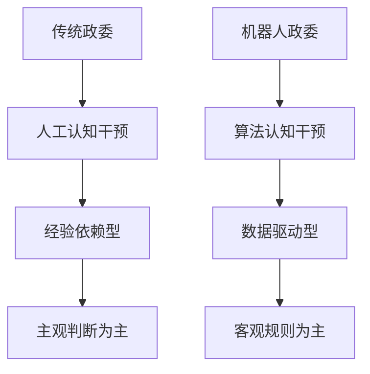
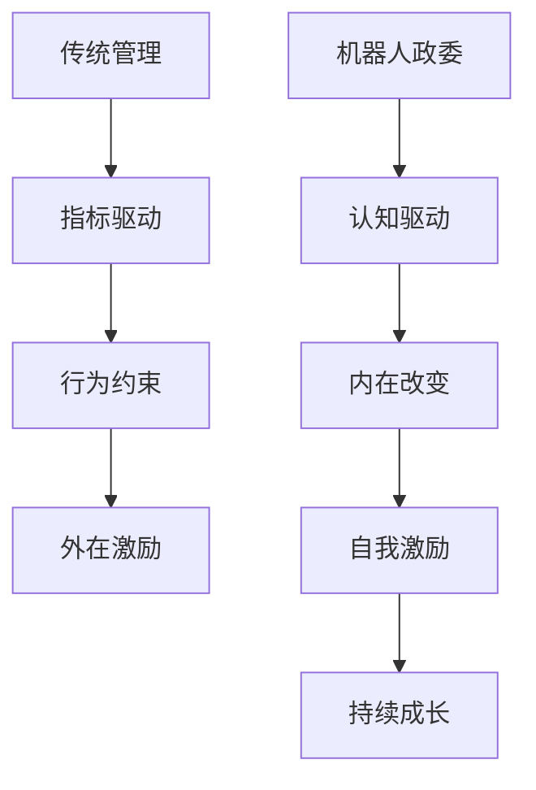
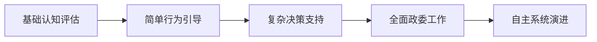

# 11-双循环管理-机器人政委系统终极目标

## 引言：从管理体系到政委系统的升华

在前10个文档的系统性论述中，我们深入解析了双循环管理架构的理论基础、技术实现和政治学方法论。现在，我们要将这些分散的论述凝聚成一个核心目标：**构建机器人政委系统**。这一句话概括了我们所有工作的终极意义，也是整个体系的价值核心和护城河所在。

## 一、机器人政委系统的核心定义

### 1.1 政委制度的本质与现代转化

**传统政委制度的精髓**：
- 业务体系与人员认知行为体系的有机结合
- 通过思想工作影响认知，进而改变行为
- 确保组织目标与个人发展的统一
- 在军队中实现战斗力与思想建设的双赢

**机器人政委系统的现代转化**：


### 1.2 系统护城河的深度解析

**可复制的技术 vs 不可复制的政治学方法论**：

| 可复制部分 | 不可复制部分（护城河） |
|-----------|---------------------|
| 工作栏系统架构 | 政治学决策引擎的方法论 |
| 探针数据采集 | 认知投射的个性化策略 |
| 自动化规则 | 政委工作的经验智慧 |
| 智能体技术 | 人员管理的艺术性判断 |

## 二、前10个文档的核心汇聚

### 2.1 文档1-5：政委系统的基础架构

**架构概述 → 嵌套结构 → 正确理解 → 双循环机制 → 关键结合点**

这些文档共同构建了政委系统的组织基础：
- **双循环架构**：政委工作的战略循环与执行循环
- **嵌套结构**：政委系统在各部门的渗透机制
- **关键结合点**：政委工作与业务执行的融合点

### 2.2 文档6-8：政委系统的智能化引擎

**结合点运行 → 自适应体系 → 自动化机制**

这些文档奠定了政委系统的技术基础：
- **自适应体系**：政委的持续学习和调整能力
- **自动化机制**：政委工作的规模化执行
- **政治学公平性**：政委决策的客观基础

### 2.3 文档9-10：政委系统的政治学灵魂

**人的自动化管理 → IT系统落地**

这些文档注入了政委系统的灵魂：
- **政治学方法论**：政委工作的理论基础
- **认知行为管理**：政委工作的核心手段
- **技术可行性**：政委系统的实现路径

## 三、机器人政委系统的运行机制

### 3.1 政治学决策引擎

**传统政委经验的方法论转化**：

```javascript
class PoliticalDecisionEngine {
  constructor() {
    this.methodology = new PoliticalMethodology();
    this.cognitiveMapper = new CognitiveMapper();
    this.behaviorPredictor = new BehaviorPredictor();
  }
  
  // 基于政治学方法论的决策
  async makePoliticalDecision(context, individuals) {
    // 1. 认知水平评估
    const cognitiveAssessments = await this.assessCognitiveLevels(individuals);
    
    // 2. 政治学规则应用
    const politicalRules = this.methodology.getRulesForContext(context);
    
    // 3. 个性化策略生成
    const strategies = this.generatePersonalizedStrategies(
      cognitiveAssessments, 
      politicalRules
    );
    
    // 4. 行为预测和效果评估
    const predictedOutcomes = await this.predictBehavioralOutcomes(strategies);
    
    return { strategies, predictedOutcomes };
  }
  
  // 认知投射的个性化决策
  generatePersonalizedStrategies(assessments, rules) {
    return assessments.map(assessment => {
      return {
        individual: assessment.individual,
        informationType: this.selectInformationType(assessment),
        deliveryMethod: this.selectDeliveryMethod(assessment),
        timing: this.calculateOptimalTiming(assessment),
        intensity: this.adjustInterventionIntensity(assessment)
      };
    });
  }
}
```

### 3.2 认知行为管理闭环

**从传统指标驱动到认知行为驱动的革命**：



### 3.3 自循环演进机制

**政委系统的自我优化和学习**：

```javascript
class政委系统自演进 {
  constructor() {
    this.learningDatabase = new PoliticalLearningDB();
    this.effectivenessTracker = new EffectivenessTracker();
    this.methodologyOptimizer = new MethodologyOptimizer();
  }
  
  // 自循环演进过程
  async selfEvolve() {
    // 1. 效果数据收集
    const effectivenessData = await this.effectivenessTracker.collectData();
    
    // 2. 方法论评估
    const methodologyAssessment = await this.assessMethodologyEffectiveness(
      effectivenessData
    );
    
    // 3. 规则优化
    const optimizedRules = await this.methodologyOptimizer.optimizeRules(
      methodologyAssessment
    );
    
    // 4. 系统更新
    await this.updatePoliticalDecisionEngine(optimizedRules);
    
    // 5. 新循环开始
    this.initiateNewCycle();
  }
  
  // 政治学方法论的持续优化
  async optimizePoliticalMethodology() {
    const historicalCases = await this.learningDatabase.getHistoricalCases();
    const currentEffectiveness = await this.effectivenessTracker.getCurrentMetrics();
    
    // 基于历史成功案例优化当前方法论
    return this.methodologyOptimizer.learnFromHistory(
      historicalCases, 
      currentEffectiveness
    );
  }
}
```

## 四、机器人政委系统的独特价值

### 4.1 超越西式管理学的认知革命

**指标驱动 vs 认知驱动对比**：

| 西式绩效管理 | 机器人政委系统 |
|-------------|---------------|
| KPI指标考核 | 认知水平评估 |
| 物质激励 | 内在动机激发 |
| 行为约束 | 价值观塑造 |
| 短期业绩 | 长期发展 |
| 标准化流程 | 个性化策略 |

### 4.2 政委工作的人工智能赋能

**传统政委工作的局限性**：
- 经验依赖性强，难以规模化
- 主观判断多，一致性难保证
- 响应速度慢，难以实时干预
- 覆盖范围有限，个性化程度低

**机器人政委系统的优势**：
- 基于数据的客观决策
- 7×24小时实时响应
- 全员覆盖的个性化管理
- 持续学习和优化能力

### 4.3 组织文化的智能塑造

**价值观传导的自动化**：

```javascript
class价值观传导系统 {
  constructor() {
    this.coreValues = new OrganizationalValues();
    this.valueAlignmentEngine = new ValueAlignmentEngine();
    this.culturalPropagator = new CulturalPropagator();
  }
  
  // 自动化价值观传导
  async propagateOrganizationalValues() {
    // 1. 价值观与个人认知的对接
    const valueAlignmentStrategies = await this.valueAlignmentEngine.createStrategies();
    
    // 2. 多通道价值观传导
    await this.culturalPropagator.executeMultiChannelPropagation(
      valueAlignmentStrategies
    );
    
    // 3. 传导效果评估和优化
    const propagationEffectiveness = await this.assessPropagationEffectiveness();
    
    return this.optimizePropagationStrategies(propagationEffectiveness);
  }
  
  // 基于认知水平的个性化价值观传导
  createPersonalizedValuePropagation(individual) {
    const cognitiveProfile = this.assessCognitiveProfile(individual);
    const valueReceptivity = this.assessValueReceptivity(cognitiveProfile);
    
    return {
      deliveryChannels: this.selectAppropriateChannels(valueReceptivity),
      contentComplexity: this.adjustContentComplexity(cognitiveProfile),
      reinforcementFrequency: this.calculateReinforcementSchedule(valueReceptivity),
      feedbackMechanisms: this.designFeedbackLoops(cognitiveProfile)
    };
  }
}
```

## 五、机器人政委系统的实施路径

### 5.1 渐进式政委功能部署

**从辅助到主导的演进**：



### 5.2 政治学方法论的数字化

**经验智慧的算法转化**：

```javascript
// 政委经验的方法论编码
class PoliticalMethodologyEncoder {
  constructor() {
    this.experienceDatabase = new政委经验库();
    this.ruleExtractor = new RuleExtractor();
    this.contextAnalyzer = new ContextAnalyzer();
  }
  
  // 政委经验的数字化编码
  async encodePoliticalExperience() {
    const historicalCases = await this.experienceDatabase.getCases();
    const successfulPatterns = this.analyzeSuccessfulPatterns(historicalCases);
    
    // 提取政治学决策规则
    const decisionRules = this.ruleExtractor.extractRules(successfulPatterns);
    
    // 建立上下文关联
    const contextualRules = await this.contextAnalyzer.establishContext(
      decisionRules
    );
    
    return this.normalizePoliticalMethodology(contextualRules);
  }
  
  // 情境化规则应用
  applyContextualRules(situation, individuals) {
    const contextType = this.classifySituation(situation);
    const applicableRules = this.getRulesForContext(contextType);
    
    return this.adaptRulesToIndividuals(applicableRules, individuals);
  }
}
```

### 5.3 人机协同的政委工作模式

**传统政委与机器人政委的协同**：

```javascript
class HumanRobot政委协同 {
  constructor() {
    this.human政委 = new Human政委();
    this.robot政委 = new Robot政委();
    this.collaborationOrchestrator = new CollaborationOrchestrator();
  }
  
  // 人机协同决策
  async collaborativeDecisionMaking(situation) {
    // 1. 机器人政委快速分析
    const robotAnalysis = await this.robot政委.analyzeSituation(situation);
    
    // 2. 人类政委经验判断
    const humanInsight = await this.human政委.provideExpertInsight(
      situation, 
      robotAnalysis
    );
    
    // 3. 协同决策制定
    const collaborativeDecision = await this.collaborationOrchestrator.orchestrate(
      robotAnalysis, 
      humanInsight
    );
    
    // 4. 执行和反馈
    const executionResult = await this.executeCollaborativeDecision(
      collaborativeDecision
    );
    
    // 5. 共同学习和优化
    await this.jointLearning(executionResult);
    
    return executionResult;
  }
}
```

## 六、机器人政委系统的护城河深度构建

### 6.1 政治学方法论的持续积累

**经验数据的网络效应**：

```javascript
class PoliticalMethodologyNetwork {
  constructor() {
    this.methodologyGraph = new MethodologyGraph();
    this.experienceNodes = new Map();
    this.learningEdges = new Set();
  }
  
  // 方法论网络的自我增强
  async strengthenMethodologyNetwork() {
    // 更多应用案例
    await this.addNewExperienceNodes();
    
    // 更深模式识别
    await this.deepenPatternRecognition();
    
    // 更准预测能力
    await this.enhancePredictiveAccuracy();
    
    // 形成方法论护城河
    return this.consolidateMethodologyMoat();
  }
  
  // 护城河的不可复制性
  getMethodologyMoat() {
    return {
      dataNetworkEffects: this.calculateNetworkEffects(),
      experienceAccumulation: this.measureExperienceAccumulation(),
      predictiveAdvantage: this.assessPredictiveAdvantage(),
      adaptationSpeed: this.evaluateAdaptationSpeed()
    };
  }
}
```

### 6.2 认知行为管理的艺术性算法化

**将政委艺术转化为科学**：

```javascript
class政委艺术算法化 {
  constructor() {
    this.artisticPrinciples = new PoliticalArtPrinciples();
    this.scientificEncoder = new ScientificEncoder();
    this.adaptiveExecutor = new AdaptiveExecutor();
  }
  
  // 政委艺术的算法编码
  async encodePoliticalArt() {
    // 直觉的算法模拟
    const intuitiveAlgorithms = await this.simulatePoliticalIntuition();
    
    // 情商的 computational 实现
    const emotionalAlgorithms = await this.computationalEmotionalIntelligence();
    
    // 说服艺术的个性化策略
    const persuasionAlgorithms = await this.personalizedPersuasionStrategies();
    
    return this.integratePoliticalArtAlgorithms(
      intuitiveAlgorithms,
      emotionalAlgorithms, 
      persuasionAlgorithms
    );
  }
}
```

## 结论：机器人政委系统的终极意义

### 7.1 前10个文档的价值凝聚

**一句话概括所有工作**：
> 我们构建的不是另一个管理系统，而是一个**机器人政委系统**——将中国军队政委制度的智慧与现代人工智能技术相结合，实现认知层面的人员管理和组织发展。

### 7.2 机器人政委系统的历史地位

**管理思想的革命性突破**：
- **从流程管理到认知管理**的范式转移
- **从西方绩效到东方智慧**的文化自信
- **从人工经验到算法智能**的技术飞跃
- **从局部优化到系统演进**的哲学升华

### 7.3 未来展望

**机器人政委系统的演进方向**：
1. **更加精准的认知映射**
2. **更深层次的行为预测** 
3. **更智能的方法论优化**
4. **更广泛的组织应用**
5. **更自主的系统演进**

### 7.4 终极目标的意义

**机器人政委系统不仅是一个技术产品，更是**：
- 中国管理智慧的现代化表达
- 人类组织管理的智能化革命
- 政治学方法论的工程化实践
- 人机协同未来的探索先锋

**这一句话——"构建机器人政委系统"——就是我们所有工作的终极目标，也是前10个文档论述的价值凝聚。每一个技术组件、每一个理论突破、每一个方法论创新，最终都服务于这个宏伟目标。**