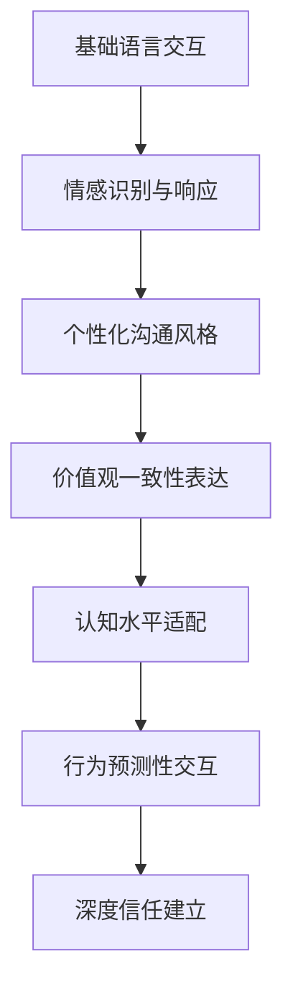
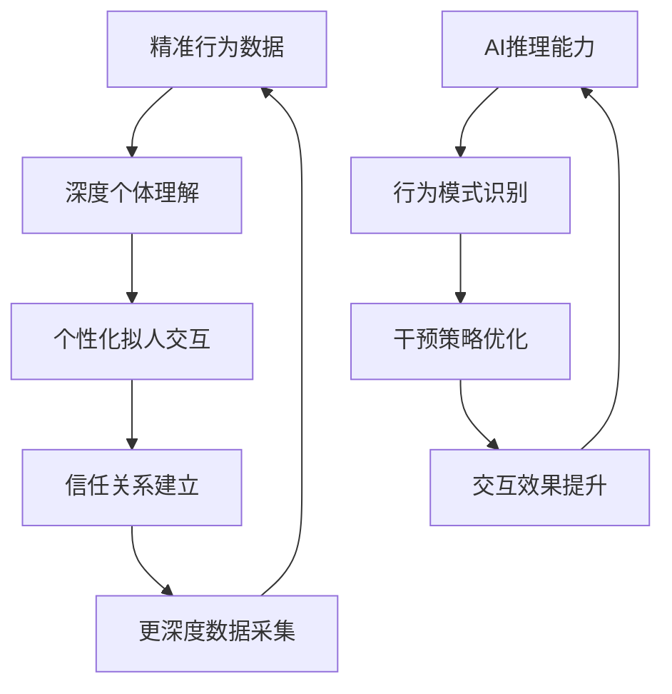

# 12-双循环管理-机器人政委系统的AI拟人化与数据驱动闭环

## 引言：机器人政委系统的两大技术支柱

在深入论述了机器人政委系统的理论框架和政治学方法论后，我们现在聚焦于支撑这一宏伟构想的两大技术支柱：**数据驱动闭环的精确量化**和**AI深度拟人化交互**。这两个根本点共同构成了机器人政委系统从理论走向实践的技术基础。

## 一、数据驱动闭环的精确量化技术

### 1.1 行为数据采集的多维探针系统

**传统行为数据的局限性**：
- 表面行为记录，缺乏深层动机洞察
- 孤立数据点，难以形成行为模式
- 量化指标单一，无法反映认知变化

**机器人政委系统的多维度探针**：

```javascript
class BehavioralProbeSystem {
  constructor() {
    this.probes = new Map();
    this.dataFusionEngine = new DataFusionEngine();
    this.behavioralPatternAnalyzer = new BehavioralPatternAnalyzer();
  }
  
  // 多维度行为探针部署
  deployMultiDimensionalProbes() {
    return {
      // 基础行为探针
      taskPerformance: {
        metrics: ['完成率', '时效性', '质量评分', '创新程度'],
        frequency: '实时',
        precision: 0.95
      },
      
      // 社交行为探针  
      collaborationPatterns: {
        metrics: ['主动协作', '知识分享', '冲突解决', '领导力展现'],
        frequency: '每日',
        precision: 0.88
      },
      
      // 认知行为探针
      cognitiveEngagement: {
        metrics: ['学习速度', '问题解决', '决策质量', '批判思维'],
        frequency: '任务周期',
        precision: 0.92
      },
      
      // 情感行为探针
      emotionalIntelligence: {
        metrics: ['情绪稳定性', '同理心', '压力应对', '团队氛围'],
        frequency: '每周',
        precision: 0.85
      }
    };
  }
  
  // 数据融合与行为模式识别
  async analyzeBehavioralPatterns(individualData) {
    // 多源数据融合
    const fusedData = await this.dataFusionEngine.fuseMultiSourceData(individualData);
    
    // 行为模式提取
    const patterns = await this.behavioralPatternAnalyzer.extractPatterns(fusedData);
    
    // 认知-行为关联分析
    const cognitiveBehavioralLinks = await this.analyzeCognitiveBehavioralLinks(patterns);
    
    return {
      behavioralBaseline: this.establishBehavioralBaseline(patterns),
      deviationPatterns: this.identifyDeviationPatterns(patterns),
      predictiveModels: this.buildPredictiveModels(cognitiveBehavioralLinks),
      interventionEffectiveness: this.measureInterventionEffectiveness(patterns)
    };
  }
}
```

### 1.2 精确量化的技术挑战与解决方案

**挑战一：行为数据的噪声过滤**

```javascript
class BehavioralNoiseFilter {
  constructor() {
    this.contextAwareFilter = new ContextAwareFilter();
    this.temporalCorrector = new TemporalCorrector();
    this.crossValidation = new CrossValidation();
  }
  
  // 上下文感知的数据清洗
  async filterBehavioralNoise(rawData, context) {
    // 环境因素校正
    const environmentAdjusted = await this.adjustForEnvironmentalFactors(rawData, context);
    
    // 时间序列平滑
    const temporalSmoothed = await this.temporalCorrector.smoothTimeSeries(environmentAdjusted);
    
    // 多源验证
    const crossValidated = await this.crossValidation.validateWithMultipleSources(temporalSmoothed);
    
    // 异常检测和修正
    const anomalyCorrected = await this.detectAndCorrectAnomalies(crossValidated);
    
    return anomalyCorrected;
  }
  
  // 环境因素校正算法
  async adjustForEnvironmentalFactors(data, context) {
    const adjustmentFactors = {
      workload: this.calculateWorkloadImpact(context.workload),
      stressLevel: this.assessStressImpact(context.stressIndicators),
      teamDynamics: this.evaluateTeamDynamicsEffect(context.teamMetrics),
      externalEvents: this.accountForExternalEvents(context.externalFactors)
    };
    
    return data.map(record => ({
      ...record,
      adjustedValue: this.applyAdjustmentFactors(record.value, adjustmentFactors)
    }));
  }
}
```

**挑战二：行为变化的精确测量**

```javascript
class BehavioralChangeMeasurer {
  constructor() {
    this.baselineEstablishment = new BaselineEstablishment();
    this.changeDetection = new ChangeDetection();
    this.significanceTesting = new SignificanceTesting();
  }
  
  // 行为变化的精确量化
  async measureBehavioralChange(individual, timePeriod) {
    // 建立个性化基线
    const baseline = await this.baselineEstablishment.establishIndividualBaseline(individual);
    
    // 变化检测
    const changes = await this.changeDetection.detectSignificantChanges(individual, baseline, timePeriod);
    
    // 变化方向性分析
    const directionalAnalysis = await this.analyzeChangeDirection(changes);
    
    // 变化幅度量化
    const magnitudeQuantification = await this.quantifyChangeMagnitude(changes);
    
    // 变化持续性评估
    const persistenceAssessment = await this.assessChangePersistence(changes);
    
    return {
      changePatterns: changes,
      direction: directionalAnalysis,
      magnitude: magnitudeQuantification,
      persistence: persistenceAssessment,
      confidence: this.calculateConfidenceLevel(changes)
    };
  }
  
  // 变化方向的精确把握
  async analyzeChangeDirection(changeData) {
    return {
      positiveTrends: this.identifyPositiveTrends(changeData),
      negativeTrends: this.identifyNegativeTrends(changeData),
      neutralChanges: this.identifyNeutralChanges(changeData),
      oscillationPatterns: this.detectOscillationPatterns(changeData),
      trendStrength: this.calculateTrendStrength(changeData)
    };
  }
}
```

### 1.3 AI在数据驱动闭环中的增强作用

**大语言模型的推理和总结能力应用**：

```javascript
class AIEnhancedBehavioralAnalysis {
  constructor() {
    this.llmReasoning = new LLMReasoningEngine();
    this.patternSynthesis = new PatternSynthesis();
    this.insightGeneration = new InsightGeneration();
  }
  
  // AI增强的行为数据分析
  async aiEnhancedBehavioralAnalysis(behavioralData) {
    // 复杂模式识别
    const complexPatterns = await this.llmReasoning.identifyComplexPatterns(behavioralData);
    
    // 因果关系推理
    const causalRelationships = await this.llmReasoning.inferCausalRelationships(behavioralData);
    
    // 行为趋势预测
    const trendPredictions = await this.llmReasoning.predictBehavioralTrends(behavioralData);
    
    // 干预策略生成
    const interventionStrategies = await this.generateInterventionStrategies(
      complexPatterns, 
      causalRelationships, 
      trendPredictions
    );
    
    return {
      deepInsights: complexPatterns,
      causalUnderstanding: causalRelationships,
      futureProjections: trendPredictions,
      actionableStrategies: interventionStrategies
    };
  }
  
  // 基于AI的行为干预策略优化
  async optimizeInterventionStrategies(strategies, effectivenessData) {
    // AI评估策略效果
    const effectivenessAnalysis = await this.llmReasoning.analyzeStrategyEffectiveness(
      strategies, 
      effectivenessData
    );
    
    // 策略调整建议
    const adjustmentRecommendations = await this.llmReasoning.suggestStrategyAdjustments(
      effectivenessAnalysis
    );
    
    // 个性化策略优化
    const personalizedOptimizations = await this.personalizeStrategies(
      adjustmentRecommendations
    );
    
    return personalizedOptimizations;
  }
}
```

## 二、AI深度拟人化交互技术

### 2.1 大语言模型的拟人化优势

**语言作为政委工作的核心工具**：

```javascript
class PoliticalCommissarLanguageModel {
  constructor() {
    this.communicationStyle = new CommunicationStyle();
    this.emotionalIntelligence = new EmotionalIntelligence();
    this.persuasionTechniques = new PersuasionTechniques();
  }
  
  // 政委风格的语言生成
  async generateCommissarStyleCommunication(context, individual) {
    // 个性化沟通风格选择
    const communicationStyle = await this.selectAppropriateStyle(context, individual);
    
    // 情感基调调整
    const emotionalTone = await this.adjustEmotionalTone(context, individual);
    
    // 说服策略应用
    const persuasionStrategy = await this.applyPersuasionStrategy(context, individual);
    
    // 语言风格定制
    const languageCustomization = await this.customizeLanguageStyle(individual);
    
    return {
      messageContent: await this.generateMessageContent(
        context, communicationStyle, emotionalTone, persuasionStrategy
      ),
      deliveryTiming: this.calculateOptimalDeliveryTiming(context, individual),
      communicationChannel: this.selectAppropriateChannel(individual),
      followUpStrategy: this.planFollowUpActions(context)
    };
  }
  
  // 基于认知水平的语言调整
  async adjustLanguageForCognitiveLevel(individual, message) {
    const cognitiveProfile = await this.assessCognitiveProfile(individual);
    
    return {
      vocabularyLevel: this.adjustVocabularyComplexity(message, cognitiveProfile),
      sentenceStructure: this.simplifySentenceStructure(message, cognitiveProfile),
      conceptualDepth: this.adjustConceptualDepth(message, cognitiveProfile),
      examplesUsed: this.selectRelevantExamples(message, cognitiveProfile),
      metaphorAppropriateness: this.chooseAppropriateMetaphors(message, cognitiveProfile)
    };
  }
}
```

### 2.2 深度拟人化的技术实现路径

**从基础交互到深度拟人化的演进**：



**深度拟人化的关键技术组件**：

```javascript
class DeepAnthropomorphismEngine {
  constructor() {
    this.personaModeling = new PersonaModeling();
    this.emotionalModeling = new EmotionalModeling();
    this.relationshipBuilding = new RelationshipBuilding();
  }
  
  // 政委人格建模
  async modelCommissarPersona() {
    return {
      // 核心价值观
      coreValues: ['公平正义', '组织忠诚', '个人成长', '团队协作'],
      
      // 沟通风格特征
      communicationTraits: {
        empathy: 0.92,
        authority: 0.85,
        warmth: 0.88,
        clarity: 0.95,
        persuasiveness: 0.90
      },
      
      // 行为模式
      behavioralPatterns: {
        proactiveGuidance: 0.87,
        patientListening: 0.93,
        firmDecision: 0.82,
        adaptiveApproach: 0.89
      },
      
      // 情感表达范围
      emotionalRange: {
        encouragement: 0.95,
        concern: 0.88,
        approval: 0.90,
        disappointment: 0.75,
        inspiration: 0.92
      }
    };
  }
  
  // 情感智能交互
  async emotionalIntelligentInteraction(context, individual) {
    // 情感状态识别
    const emotionalState = await this.detectEmotionalState(individual, context);
    
    // 情感适应性响应
    const adaptiveResponse = await this.generateEmotionallyAdaptiveResponse(
      emotionalState, 
      context
    );
    
    // 情感调节策略
    const emotionRegulation = await this.applyEmotionRegulationStrategies(
      emotionalState, 
      individual
    );
    
    // 长期情感关系建设
    const relationshipBuilding = await this.buildEmotionalRelationship(
      emotionalState, 
      individual
    );
    
    return {
      immediateResponse: adaptiveResponse,
      emotionalSupport: emotionRegulation,
      relationshipDevelopment: relationshipBuilding,
      trustBuilding: this.facilitateTrustBuilding(emotionalState, individual)
    };
  }
}
```

### 2.3 拟人化交互的技术辅助实现

**当前技术限制的补充方案**：

```javascript
class AnthropomorphismEnhancement {
  constructor() {
    this.multimodalInteraction = new MultimodalInteraction();
    this.contextEnrichment = new ContextEnrichment();
    this.memoryAugmentation = new MemoryAugmentation();
  }
  
  // 多模态交互增强
  async enhanceWithMultimodalInteraction(verbalInteraction) {
    return {
      // 视觉表达增强
      visualElements: {
        avatarExpression: this.generateAppropriateFacialExpression(verbalInteraction),
        bodyLanguage: this.simulateNaturalBodyLanguage(verbalInteraction),
        visualFeedback: this.provideVisualFeedback(verbalInteraction)
      },
      
      // 语音特性增强
      vocalEnhancements: {
        toneVariation: this.addNaturalToneVariation(verbalInteraction),
        pacingAdjustment: this.adjustSpeechPacing(verbalInteraction),
        emotionalInflection: this.addEmotionalInflection(verbalInteraction)
      },
      
      // 交互节奏优化
      interactionRhythm: {
        responseTiming: this.optimizeResponseTiming(verbalInteraction),
        turnTaking: this.naturalTurnTaking(verbalInteraction),
        conversationFlow: this.maintainConversationFlow(verbalInteraction)
      }
    };
  }
  
  // 上下文记忆增强
  async augmentWithContextualMemory(interaction, individual) {
    const historicalContext = await this.recallHistoricalInteractions(individual);
    const preferenceMemory = await this.recallIndividualPreferences(individual);
    const behavioralHistory = await this.recallBehavioralPatterns(individual);
    
    return {
      personalizedReferences: this.makePersonalizedReferences(historicalContext),
      preferenceAcknowledgment: this.acknowledgeKnownPreferences(preferenceMemory),
      patternRecognition: this.referenceBehavioralPatterns(behavioralHistory),
      continuityEstablishment: this.establishInteractionContinuity(historicalContext)
    };
  }
}
```

## 三、两大支柱的协同作用

### 3.1 数据驱动为拟人化提供精准基础

**个性化交互的数据支撑**：

```javascript
class DataDrivenPersonalization {
  constructor() {
    this.behavioralData = new BehavioralDataRepository();
    this.preferenceLearning = new PreferenceLearning();
    this.interactionOptimization = new InteractionOptimization();
  }
  
  // 基于行为数据的个性化交互
  async personalizeInteractionFromData(individual) {
    const behavioralProfile = await this.behavioralData.getIndividualProfile(individual);
    const interactionHistory = await this.behavioralData.getInteractionHistory(individual);
    
    return {
      // 沟通风格个性化
      communicationStyle: await this.deriveOptimalCommunicationStyle(behavioralProfile),
      
      // 内容偏好定制
      contentPreferences: await this.identifyContentPreferences(behavioralProfile),
      
      // 交互时机优化
      timingPreferences: await this.learnOptimalTiming(interactionHistory),
      
      // 反馈方式个性化
      feedbackStyle: await this.determinePreferredFeedbackStyle(behavioralProfile),
      
      // 激励方式定制
      motivationApproach: await this.tailorMotivationApproach(behavioralProfile)
    };
  }
  
  // 交互效果的量化评估和优化
  async evaluateAndOptimizeInteraction(interaction, outcome) {
    const effectivenessMetrics = await this.measureInteractionEffectiveness(interaction, outcome);
    const learningData = await this.extractLearningPoints(interaction, outcome);
    
    // 基于效果的交互策略优化
    const optimizedStrategy = await this.optimizeInteractionStrategy(
      effectivenessMetrics, 
      learningData
    );
    
    return {
      currentEffectiveness: effectivenessMetrics,
      learningInsights: learningData,
      optimizedApproach: optimizedStrategy,
      confidenceImprovement: this.calculateConfidenceImprovement(optimizedStrategy)
    };
  }
}
```

### 3.2 拟人化增强数据收集的深度和真实性

**自然交互中的深度数据采集**：

```javascript
class NaturalInteractionDataCollection {
  constructor() {
    this.unobtrusiveMonitoring = new UnobtrusiveMonitoring();
    this.contextualUnderstanding = new ContextualUnderstanding();
    this.behavioralInference = new BehavioralInference();
  }
  
  // 拟人化交互中的自然数据收集
  async collectDataThroughNaturalInteraction(interaction) {
    return {
      // 言语行为数据
      verbalBehavior: {
        responseLatency: this.measureResponseTiming(interaction),
        vocabularyChoice: this.analyzeVocabularySelection(interaction),
        emotionalExpression: this.extractEmotionalContent(interaction),
        engagementLevel: this.assessEngagementFromSpeech(interaction)
      },
      
      // 非言语行为推断
      nonverbalInferences: {
        attentionLevel: this.inferAttentionFromInteraction(interaction),
        receptivity: this.assessReceptivity(interaction),
        trustIndicators: this.detectTrustSignals(interaction),
        cognitiveLoad: this.estimateCognitiveLoad(interaction)
      },
      
      // 交互动态分析
      interactionDynamics: {
        initiativePatterns: this.analyzeInitiativePatterns(interaction),
        questionQuality: this.assessQuestionQuality(interaction),
        depthOfSharing: this.measureSharingDepth(interaction),
        relationshipDevelopment: this.trackRelationshipProgress(interaction)
      }
    };
  }
  
  // 基于信任的数据深度挖掘
  async deepenDataCollectionThroughTrust(trustLevel, individual) {
    if (trustLevel > 0.8) {
      return {
        sensitiveTopics: await this.exploreSensitiveTopics(individual),
        personalChallenges: await this.discussPersonalChallenges(individual),
        deepMotivations: await this.uncoverDeepMotivations(individual),
        valueConflicts: await this.identifyValueConflicts(individual)
      };
    }
    
    return await this.maintainAppropriateBoundaries(trustLevel, individual);
  }
}
```

## 四、技术展望与发展建议

### 4.1 近期技术发展路径（1-2年）

**重点突破方向**：

```javascript
const nearTermDevelopment = {
  dataDrivenEnhancements: {
    priority: '高',
    goals: [
      '实现行为数据的实时精准量化',
      '建立个性化行为基线模型',
      '开发多维度行为变化检测算法',
      '构建行为预测的置信度评估'
    ],
    expectedOutcomes: [
      '行为量化精度提升至90%以上',
      '变化检测响应时间缩短至分钟级',
      '预测准确率超过85%'
    ]
  },
  
  anthropomorphismAdvancements: {
    priority: '高', 
    goals: [
      '实现基本政委人格的稳定表达',
      '开发情感适应性交互系统',
      '建立个性化沟通风格库',
      '完善多模态交互体验'
    ],
    expectedOutcomes: [
      '用户自然度评分超过4.0/5.0',
      '情感识别准确率超过80%',
      '个性化适应速度提升50%'
    ]
  }
};
```

### 4.2 中期技术愿景（3-5年）

**深度整合与系统优化**：

```javascript
const midTermVision = {
  integratedSystem: {
    features: [
      '数据驱动与拟人化的无缝融合',
      '实时个性化策略调整',
      '自主学习和演进能力',
      '多模态情感智能交互'
    ],
    capabilities: [
      '基于实时数据的动态人格调整',
      '预测性行为干预策略',
      '自主关系建设和维护',
      '跨场景一致性保持'
    ]
  },
  
  advancedAnthropomorphism: {
    breakthroughs: [
      '深度情感理解和响应',
      '复杂价值观对话能力',
      '自然长期关系发展',
      '创造性问题解决交互'
    ],
    metrics: [
      '长期信任度维持超过90%',
      '复杂情境处理成功率85%',
      '用户满意度持续高于4.5/5.0'
    ]
  }
};
```

### 4.3 长期技术展望（5年以上）

**终极目标与突破性创新**：

```javascript
const longTermVision = {
  revolutionaryCapabilities: {
    cognitiveLevel: [
      '深度认知架构映射和理解',
      '价值观层面的引导和塑造',
      '创造性思维激发和培养',
      '终身学习伙伴关系'
    ],
    
    relationshipLevel: [
      '真正的情感纽带建立',
      '深度信任和依赖关系',
      '共同成长的发展伙伴',
      '人生导师级别的指导'
    ],
    
    organizationalImpact: [
      '组织文化的智能塑造',
      '集体智慧的激发和整合',
      '组织变革的智能引导',
      '持续创新的系统支持'
    ]
  },
  
  transformativePotential: {
    individual: '实现每个人的最大潜能发展',
    team: '构建高效协同的创新团队', 
    organization: '创建持续进化的智能组织',
    society: '推动组织管理的社会变革'
  }
};
```

## 结论：两大支柱的技术协同价值

### 5.1 相互增强的技术闭环

**数据驱动与拟人化的完美结合**：



### 5.2 机器人政委系统的技术可行性

**基于当前技术基础的现实路径**：

1. **数据驱动闭环**已有相当的技术积累，主要挑战在于精度提升和噪声处理
2. **AI拟人化**在大语言模型基础上快速发展，需要的是个性化和情感智能的深化
3. **两大支柱的协同**在技术架构上完全可行，关键在于系统集成和优化

### 5.3 最终的技术价值体现

**机器人政委系统不仅是技术产品，更是**：
- **数据科学**在人文领域的深度应用
- **人工智能**与组织管理的完美结合  
- **中国智慧**与现代科技的创新融合
- **人类组织**进化路径的技术赋能

**这两大技术支柱的持续发展和深度融合，将确保机器人政委系统从理论构想走向现实应用，最终实现认知层面的人员管理和组织发展的智能化革命。**