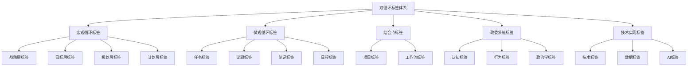
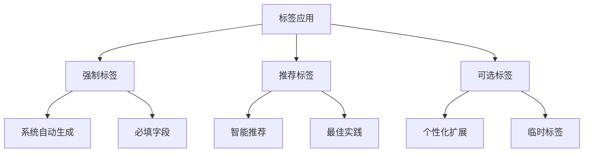

# 13-双循环管理-全域适用的标签体系初稿

## 引言：基于双循环架构的标签体系设计

基于前12个文档对双循环管理架构的深度分析，我现在设计一个全域适用的标签体系初稿。这个标签体系将贯穿宏观循环、微观循环、关键结合点以及机器人政委系统的各个层面，为整个管理架构提供统一的分类、检索和关联基础。

## 一、标签体系设计原则

### 1.1 双循环架构适配原则

```javascript
// 标签体系设计原则
const tagDesignPrinciples = {
  dualCycleAlignment: {
    macroCycleTags: '支持战略→目标→规划→计划路径',
    microCycleTags: '支持任务→议题→笔记→日程弥散',
    convergenceTags: '支持项目/工作流关键结合点'
  },
  robotCommissarSupport: {
    cognitiveTags: '支持认知水平评估',
    behavioralTags: '支持行为模式识别',
    politicalTags: '支持政治学决策引擎'
  },
  systemWideApplicability: {
    universal: '所有管理元素通用',
    hierarchical: '支持多级标签嵌套',
    crossReferencing: '支持跨模块关联'
  }
};
```

### 1.2 标签分类架构



## 二、宏观循环标签体系

### 2.1 战略层标签

```json
{
  "strategic_level": {
    "vision_direction": [
      "战略愿景",
      "发展方向",
      "使命宣言",
      "核心价值观"
    ],
    "market_position": [
      "市场定位",
      "竞争优势",
      "行业趋势",
      "竞争分析"
    ],
    "resource_allocation": [
      "资源战略",
      "投资方向",
      "能力建设",
      "技术路线"
    ],
    "risk_management": [
      "战略风险",
      "机会识别",
      "不确定性",
      "应急预案"
    ]
  }
}
```

### 2.2 目标层标签

```json
{
  "goal_level": {
    "objective_type": [
      "财务目标",
      "市场目标", 
      "产品目标",
      "技术目标",
      "人才目标",
      "文化目标"
    ],
    "time_frame": [
      "长期目标-5年",
      "中期目标-3年", 
      "短期目标-1年",
      "季度目标",
      "月度目标"
    ],
    "measurement": [
      "KPI指标",
      "OKR目标",
      "定性目标",
      "定量目标",
      "里程碑"
    ],
    "priority": [
      "P0-关键紧急",
      "P1-重要紧急", 
      "P2-重要不紧急",
      "P3-常规任务"
    ]
  }
}
```

### 2.3 规划层标签

```json
{
  "planning_level": {
    "plan_type": [
      "业务规划",
      "产品规划",
      "技术规划",
      "人力资源规划",
      "财务规划",
      "市场规划"
    ],
    "planning_phase": [
      "规划启动",
      "现状分析",
      "方案设计",
      "评审决策",
      "执行准备"
    ],
    "resource_planning": [
      "预算规划",
      "人员规划",
      "设备规划",
      "时间规划",
      "风险规划"
    ],
    "constraints": [
      "时间约束",
      "资源约束",
      "技术约束",
      "政策约束",
      "市场约束"
    ]
  }
}
```

### 2.4 计划层标签

```json
{
  "plan_level": {
    "execution_plan": [
      "行动计划",
      "实施计划",
      "监控计划",
      "调整计划"
    ],
    "timeline": [
      "日计划",
      "周计划", 
      "月计划",
      "季度计划",
      "年度计划"
    ],
    "responsibility": [
      "负责人计划",
      "团队计划",
      "部门计划",
      "跨部门计划"
    ],
    "contingency": [
      "备用计划",
      "应急计划",
      "风险应对计划",
      "变更管理计划"
    ]
  }
}
```

## 三、微观循环标签体系

### 3.1 任务标签

```json
{
  "task_level": {
    "task_type": [
      "执行任务",
      "决策任务",
      "协作任务",
      "创意任务",
      "分析任务",
      "沟通任务"
    ],
    "task_status": [
      "待开始",
      "进行中",
      "已完成",
      "已暂停",
      "已取消",
      "待评审"
    ],
    "task_priority": [
      "紧急重要",
      "重要不紧急",
      "紧急不重要",
      "常规任务"
    ],
    "task_complexity": [
      "简单任务",
      "中等任务",
      "复杂任务",
      "非常复杂"
    ],
    "task_duration": [
      "短期任务-1天内",
      "中期任务-1周内",
      "长期任务-1月内",
      "超长期任务-1月以上"
    ]
  }
}
```

### 3.2 议题标签

```json
{
  "issue_level": {
    "issue_type": [
      "技术问题",
      "流程问题",
      "人员问题",
      "资源问题",
      "沟通问题",
      "决策问题"
    ],
    "issue_severity": [
      "严重-阻塞",
      "高-影响重大",
      "中-需要关注",
      "低-可后续处理"
    ],
    "issue_scope": [
      "个人议题",
      "团队议题",
      "部门议题",
      "跨部门议题",
      "组织级议题"
    ],
    "resolution_status": [
      "新发现",
      "分析中",
      "解决方案中",
      "已解决",
      "已验证",
      "已关闭"
    ]
  }
}
```

### 3.3 笔记标签

```json
{
  "note_level": {
    "note_type": [
      "会议记录",
      "学习笔记",
      "灵感记录",
      "问题分析",
      "决策依据",
      "经验总结"
    ],
    "knowledge_domain": [
      "技术知识",
      "业务知识",
      "管理知识",
      "行业知识",
      "个人发展"
    ],
    "sharing_level": [
      "个人笔记",
      "团队共享",
      "部门共享",
      "全员公开"
    ],
    "maturity_level": [
      "草稿笔记",
      "整理中",
      "成熟内容",
      "最佳实践"
    ]
  }
}
```

### 3.4 日程标签

```json
{
  "schedule_level": {
    "event_type": [
      "会议",
      "培训",
      "评审",
      "汇报",
      "协作",
      "个人工作"
    ],
    "time_sensitivity": [
      "固定时间",
      "灵活时间",
      "截止时间",
      "提醒时间"
    ],
    "participants": [
      "个人日程",
      "团队日程",
      "部门日程",
      "跨部门日程"
    ],
    "recurrence": [
      "一次性",
      "每日重复",
      "每周重复",
      "每月重复",
      "每年重复"
    ]
  }
}
```

## 四、关键结合点标签体系

### 4.1 项目标签

```json
{
  "project_level": {
    "project_phase": [
      "项目启动",
      "需求分析",
      "方案设计",
      "开发实施",
      "测试验证",
      "上线运营",
      "项目收尾"
    ],
    "project_scale": [
      "小型项目",
      "中型项目",
      "大型项目",
      "特大型项目"
    ],
    "project_complexity": [
      "简单项目",
      "中等项目",
      "复杂项目",
      "高度复杂项目"
    ],
    "project_risk": [
      "低风险项目",
      "中风险项目",
      "高风险项目",
      "极高风险项目"
    ],
    "stakeholders": [
      "内部项目",
      "客户项目",
      "合作伙伴项目",
      "政府项目"
    ]
  }
}
```

### 4.2 工作流标签

```json
{
  "workflow_level": {
    "workflow_type": [
      "审批流程",
      "执行流程",
      "协作流程",
      "决策流程",
      "反馈流程"
    ],
    "automation_level": [
      "全手动",
      "部分自动化",
      "高度自动化",
      "全自动化"
    ],
    "integration_level": [
      "独立工作流",
      "部门内集成",
      "跨部门集成",
      "全系统集成"
    ],
    "efficiency_level": [
      "低效流程",
      "一般效率",
      "高效流程",
      "最优流程"
    ]
  }
}
```

## 五、机器人政委系统标签体系

### 5.1 认知水平标签

```json
{
  "cognitive_level": {
    "thinking_style": [
      "分析型思维",
      "创造型思维",
      "实践型思维",
      "关系型思维"
    ],
    "learning_style": [
      "视觉学习型",
      "听觉学习型",
      "动手学习型",
      "逻辑学习型"
    ],
    "decision_making": [
      "理性决策",
      "直觉决策",
      "集体决策",
      "风险规避"
    ],
    "problem_solving": [
      "系统解决",
      "创新解决",
      "经验解决",
      "协作解决"
    ]
  }
}
```

### 5.2 行为模式标签

```json
{
  "behavioral_patterns": {
    "work_style": [
      "主动积极",
      "按部就班",
      "创新突破",
      "团队协作"
    ],
    "communication_style": [
      "直接沟通",
      "委婉沟通",
      "书面沟通",
      "面对面沟通"
    ],
    "stress_response": [
      "压力驱动",
      "压力规避",
      "压力转化",
      "压力崩溃"
    ],
    "collaboration_tendency": [
      "独立工作",
      "团队合作",
      "领导协调",
      "跟随执行"
    ]
  }
}
```

### 5.3 政治学决策标签

```json
{
  "political_decision": {
    "fairness_principles": [
      "机会公平",
      "过程公平",
      "结果公平",
      "需求公平"
    ],
    "incentive_mechanisms": [
      "物质激励",
      "精神激励",
      "成长激励",
      "认可激励"
    ],
    "conflict_resolution": [
      "协商解决",
      "权威决策",
      "投票决定",
      "妥协平衡"
    ],
    "value_alignment": [
      "个人价值",
      "团队价值",
      "组织价值",
      "社会价值"
    ]
  }
}
```

## 六、技术实现标签体系

### 6.1 数据探针标签

```json
{
  "data_probes": {
    "probe_type": [
      "行为探针",
      "绩效探针",
      "协作探针",
      "学习探针"
    ],
    "data_quality": [
      "高精度数据",
      "中等精度",
      "低精度数据",
      "需要校准"
    ],
    "collection_frequency": [
      "实时采集",
      "高频采集",
      "定期采集",
      "事件触发"
    ],
    "privacy_level": [
      "公开数据",
      "内部数据",
      "敏感数据",
      "机密数据"
    ]
  }
}
```

### 6.2 AI智能体标签

```json
{
  "ai_agents": {
    "agent_type": [
      "战略智能体",
      "战术智能体",
      "操作智能体",
      "政委智能体"
    ],
    "capability_level": [
      "基础能力",
      "中等能力",
      "高级能力",
      "专家能力"
    ],
    "learning_status": [
      "初始训练",
      "持续学习",
      "稳定运行",
      "需要优化"
    ],
    "interaction_style": [
      "指导型交互",
      "协作型交互",
      "咨询型交互",
      "自主型交互"
    ]
  }
}
```

## 七、标签关联与组合规则

### 7.1 跨循环标签关联

```javascript
// 标签关联规则
const tagAssociationRules = {
  // 宏观→微观关联
  macroToMicro: {
    '战略愿景': ['长期目标', '业务规划'],
    '市场定位': ['市场目标', '竞争分析任务'],
    '资源战略': ['预算规划', '资源分配任务']
  },
  
  // 微观→宏观反馈
  microToMacro: {
    '任务完成率': ['目标达成度', '战略执行效果'],
    '议题解决': ['流程优化', '组织改进'],
    '学习笔记': ['知识积累', '能力建设']
  },
  
  // 结合点双向关联
  convergencePoints: {
    '项目进展': ['战略执行', '任务完成'],
    '工作流效率': ['流程优化', '绩效提升']
  }
};
```

### 7.2 政委系统标签集成

```javascript
// 政委系统标签集成规则
const commissarTagIntegration = {
  cognitiveIntegration: {
    '分析型思维': ['技术问题', '系统解决'],
    '创造型思维': ['创新任务', '产品规划'],
    '实践型思维': ['执行任务', '行动计划']
  },
  
  behavioralIntegration: {
    '主动积极': ['重要紧急任务', '领导协调'],
    '团队协作': ['跨部门项目', '协作流程']
  },
  
  politicalIntegration: {
    '机会公平': ['资源分配', '任务指派'],
    '过程公平': ['评审流程', '晋升机制']
  }
};
```

## 八、标签体系实施指南

### 8.1 标签应用层级



### 8.2 标签管理规范

```json
{
  "tag_management": {
    "creation_policy": {
      "system_tags": "由系统管理员创建",
      "department_tags": "由部门负责人创建",
      "personal_tags": "个人可创建但需审核"
    },
    "usage_guidelines": {
      "mandatory_tags": "必须使用的核心标签",
      "recommended_tags": "建议使用的标准标签",
      "custom_tags": "可自定义的扩展标签"
    },
    "maintenance_rules": {
      "tag_review": "季度标签审查",
      "unused_tags": "清理6个月未使用标签",
      "tag_merging": "合并相似标签"
    }
  }
}
```

### 8.3 标签搜索和发现

```javascript
// 智能标签搜索功能
class IntelligentTagSearch {
  constructor() {
    this.semanticSearch = new SemanticSearchEngine();
    this.contextAware = new ContextAwareRecommender();
    this.crossCycleLinking = new CrossCycleLinker();
  }
  
  // 基于上下文的标签推荐
  async recommendTags(context, existingTags) {
    const contextAnalysis = await this.analyzeContext(context);
    const tagRelations = await this.findRelatedTags(existingTags);
    
    return {
      mandatoryTags: this.getMandatoryTags(contextAnalysis),
      recommendedTags: this.getRecommendedTags(contextAnalysis, tagRelations),
      similarCases: this.findSimilarCases(contextAnalysis),
      crossReferences: this.findCrossCycleReferences(contextAnalysis)
    };
  }
  
  // 双循环标签导航
  async navigateDualCycleTags(startingTag) {
    return {
      macroPath: await this.traceToMacroCycle(startingTag),
      microPath: await this.traceToMicroCycle(startingTag),
      convergencePoints: await this.findConvergencePoints(startingTag),
      commissarInsights: await this.getCommissarInsights(startingTag)
    };
  }
}
```

## 九、标签体系的技术实现

### 9.1 数据库设计

```sql
-- 标签体系数据库表结构
CREATE TABLE tag_categories (
  id UUID PRIMARY KEY,
  name VARCHAR(100) NOT NULL,
  description TEXT,
  cycle_type ENUM('macro', 'micro', 'convergence', 'commissar', 'technical'),
  parent_category_id UUID REFERENCES tag_categories(id),
  created_at TIMESTAMP DEFAULT CURRENT_TIMESTAMP
);

CREATE TABLE tags (
  id UUID PRIMARY KEY,
  name VARCHAR(50) NOT NULL,
  category_id UUID REFERENCES tag_categories(id),
  description TEXT,
  color_code VARCHAR(7),
  is_mandatory BOOLEAN DEFAULT FALSE,
  usage_count INTEGER DEFAULT 0,
  created_at TIMESTAMP DEFAULT CURRENT_TIMESTAMP
);

CREATE TABLE tag_relationships (
  id UUID PRIMARY KEY,
  tag_a_id UUID REFERENCES tags(id),
  tag_b_id UUID REFERENCES tags(id),
  relationship_type ENUM('hierarchical', 'associative', 'causal', 'temporal'),
  strength FLOAT DEFAULT 1.0,
  created_at TIMESTAMP DEFAULT CURRENT_TIMESTAMP
);
```

### 9.2 API接口设计

```javascript
// 标签体系REST API
const tagAPIs = {
  // 标签查询
  GET: {
    '/api/tags': '获取所有标签',
    '/api/tags/:id': '获取特定标签详情',
    '/api/tags/category/:category': '按分类获取标签',
    '/api/tags/search/:keyword': '标签搜索',
    '/api/tags/related/:tagId': '获取相关标签'
  },
  
  // 标签管理
  POST: {
    '/api/tags': '创建新标签',
    '/api/tags/:id/relationships': '建立标签关系'
  },
  
  // 标签应用
  PUT: {
    '/api/entities/:entityId/tags': '为实体添加标签',
    '/api/entities/:entityId/tags/:tagId': '更新实体标签'
  }
};
```

## 结论：全域标签体系的价值

### 10.1 对双循环架构的支持

**宏观循环支持**：
- 战略目标的清晰分类和追踪
- 规划计划的标准化描述
- 资源分配的精确标签

**微观循环支持**：
- 任务议题的精细化管理
- 知识笔记的系统化组织
- 日程安排的高效协调

**关键结合点支持**：
- 项目工作流的统一标签
- 跨循环信息的无缝链接
- 结合点数据的智能分析

### 10.2 对机器人政委系统的赋能

**认知行为分析**：
- 人员认知模式的标签化描述
- 行为模式的系统化分类
- 个性化管理的标签基础

**政治学决策**：
- 公平性原则的标签体现
- 激励机制的分类标准
- 价值对齐的度量标签

### 10.3 技术实现优势

**数据一致性**：
- 统一的标签标准确保数据质量
- 标准化的分类支持系统集成
- 一致的命名规范促进协作

**智能分析基础**：
- 丰富的标签数据支持机器学习
- 清晰的标签关系助力模式识别
- 完整的标签历史支持趋势分析

这个全域适用的标签体系初稿为双循环管理架构提供了统一的分类和关联基础，支持从战略规划到具体执行的全流程管理，同时为机器人政委系统的智能化决策提供了丰富的数据标签基础。