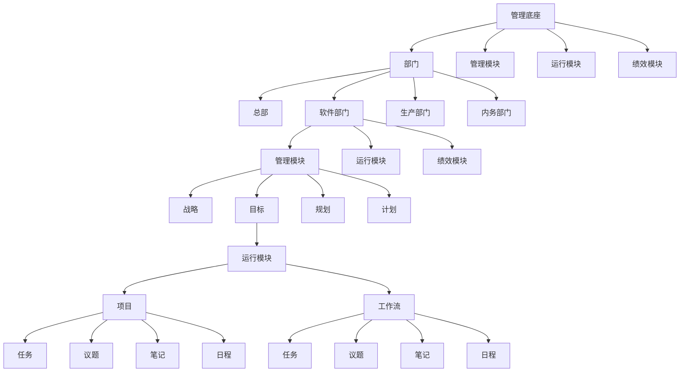
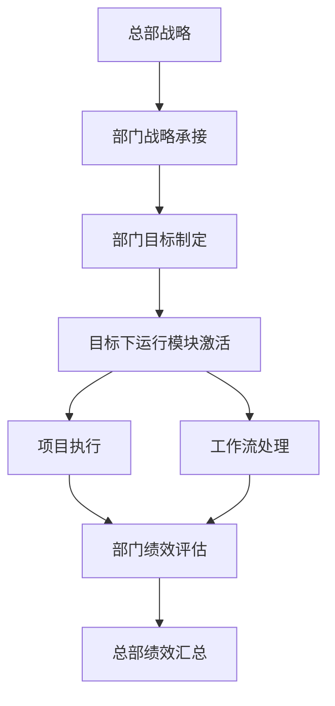

# 嵌套多层级管理体系深度解析

## 1. 嵌套架构全景视图

本管理体系采用**深度嵌套的多层级结构**，实现了从组织层面到执行层面的无缝衔接。核心嵌套关系如下：



## 2. 核心嵌套关系分析

### 2.1 管理模块在部门内的嵌套

#### 2.1.1 部门级管理自治
- **软件部门**拥有完整的管理模块体系
- 部门内部实现自我管理和决策
- 支持部门特色化运营模式

**嵌套结构：**
```
软件部门
├── 管理模块
│   ├── 战略（部门级）
│   ├── 目标（部门级）
│   ├── 规划（部门级）
│   └── 计划（部门级）
├── 运行模块
└── 绩效模块
```

#### 2.1.2 嵌套管理模块的功能定位
- **战略嵌套**：部门级战略承接总部战略
- **目标嵌套**：将部门战略转化为具体目标
- **规划嵌套**：制定部门实施路径
- **计划嵌套**：细化到可执行的行动计划

### 2.2 运行模块在管理模块内的嵌套

#### 2.2.1 目标驱动的运行嵌套
在软件部门的管理模块中，**目标节点下直接嵌套运行模块**，形成独特的"目标-执行"直通机制：

```
目标（部门级）
└── 运行模块
    ├── 项目
    │   ├── 任务
    │   ├── 议题
    │   ├── 笔记
    │   └── 日程
    └── 工作流
        ├── 任务
        ├── 议题
        ├── 笔记
        └── 日程
```

#### 2.2.2 嵌套运行模块的业务意义
- **即时执行**：目标一旦确定，立即启动执行机制
- **资源预置**：为每个目标预配置运行资源
- **进度可视**：目标与执行的直接关联确保透明度

## 3. 嵌套架构的业务逻辑

### 3.1 多层次决策流



### 3.2 嵌套执行机制

#### 3.2.1 部门级执行自主权
- 每个部门拥有独立的运行模块
- 部门内部实现完整的PDCA循环
- 支持部门特色化的工作模式

#### 3.2.2 目标-执行直通机制
- 消除战略与执行之间的断层
- 确保每个目标都有对应的执行载体
- 实现"说到做到"的管理闭环

## 4. 嵌套架构的设计优势

### 4.1 组织灵活性
- **模块化嵌套**：各部门可根据业务特点定制管理模块
- **粒度可控**：从宏观战略到微观任务的全覆盖
- **快速响应**：部门级决策减少层级审批

### 4.2 管理效能
- **减少沟通成本**：部门内部闭环管理
- **提升执行效率**：目标与执行的直接关联
- **增强责任感**：部门拥有完整的权责体系

### 4.3 知识积累
- **部门级知识库**：通过嵌套的笔记和议题积累部门经验
- **最佳实践共享**：各部门运行模式可相互借鉴
- **组织学习**：嵌套结构支持试错和创新

## 5. 嵌套架构的实施挑战

### 5.1 协调复杂性
- **跨部门协同**：需要建立部门间协作机制
- **标准统一**：确保各部门管理模块的兼容性
- **信息孤岛**：防止部门嵌套导致的信息隔离

### 5.2 资源分配
- **资源竞争**：各部门嵌套模块可能争抢资源
- **优先级冲突**：部门目标与组织战略的协调
- **绩效衡量**：嵌套架构下的绩效评估复杂性

## 6. 最佳实践建议

### 6.1 嵌套架构实施路径

#### 6.1.1 阶段一：基础框架搭建


#### 6.1.2 阶段二：深度嵌套优化
- 完善部门级管理模块嵌套
- 建立目标-运行直通机制
- 优化跨部门协作流程

#### 6.1.3 阶段三：全面集成
- 实现全组织嵌套架构
- 建立统一的绩效评估体系
- 形成组织级知识管理网络

### 6.2 关键成功因素

#### 6.2.1 组织文化
- **授权文化**：信任各部门的自我管理能力
- **协作文化**：鼓励跨部门知识共享
- **学习文化**：支持试错和持续改进

#### 6.2.2 技术支持
- **统一平台**：确保各嵌套模块的技术兼容
- **数据集成**：实现嵌套架构下的数据流通
- **可视化工具**：提供嵌套关系的直观展示

#### 6.2.3 管理机制
- **清晰边界**：明确各嵌套层级的权责范围
- **定期评审**：建立嵌套架构的健康度评估
- **灵活调整**：支持根据业务变化调整嵌套结构

## 7. 嵌套架构的演进展望

### 7.1 智能化嵌套
- AI驱动的目标-执行自动匹配
- 智能化的资源分配优化
- 预测性的绩效评估

### 7.2 生态化扩展
- 供应商和客户的嵌套接入
- 合作伙伴的管理模块集成
- 产业生态的协同管理

### 7.3 自适应进化
- 基于数据的嵌套结构优化
- 自组织的管理模块组合
- 动态调整的嵌套层级

## 8. 总结

这种嵌套多层级管理体系代表了**现代组织管理的先进范式**，它通过深度嵌套实现了：

1. **组织敏捷性**：部门级自治支持快速响应市场变化
2. **执行精准性**：目标-运行的直通机制确保战略落地
3. **知识连续性**：嵌套结构保障经验的积累和传承
4. **系统韧性**：多层级嵌套增强组织的抗风险能力

该架构的成功实施将帮助组织在复杂多变的环境中保持竞争力，实现可持续的高绩效运营。嵌套不是简单的层级叠加，而是有机的业务逻辑整合，是组织能力系统化建设的体现。