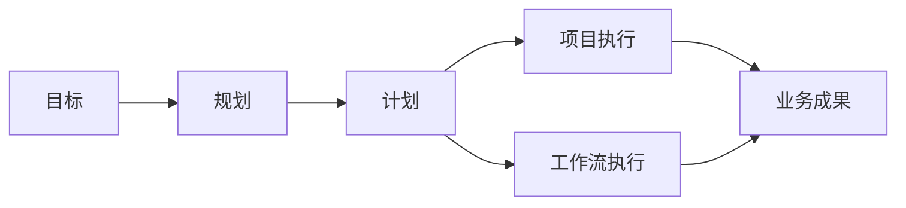
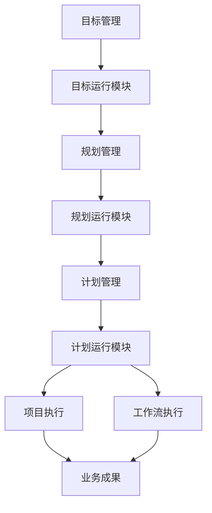
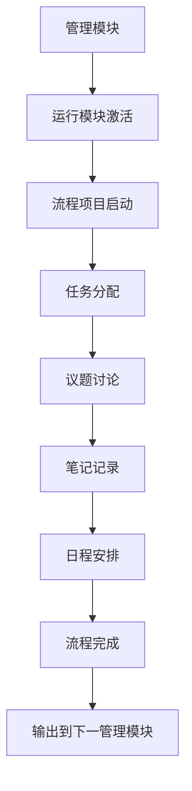
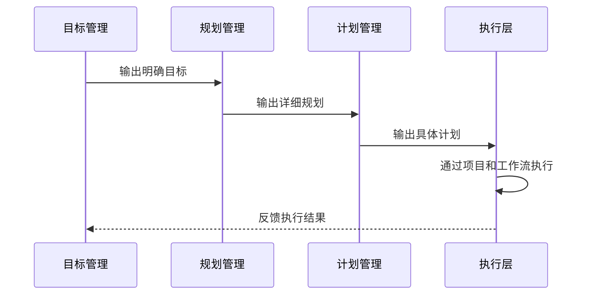

# 管理体系正确理解与架构澄清

## 1. 重新理解：运行模块的真正角色

经过深入反思和用户指导，我重新理解了脑图中运行模块的正确含义：

### 1.1 运行模块的本质是"管理流程的运行"

**错误理解**：运行模块是对整个业务项目的执行
**正确理解**：运行模块是对**管理模块本身业务流程**的运行

```
目标管理模块
└── 运行模块（针对目标管理业务的运行）
    ├── 项目（目标管理中的项目，如目标制定项目）
    │   ├── 任务（目标管理的任务）
    │   ├── 议题（目标管理的讨论议题）
    │   ├── 笔记（目标管理的记录）
    │   └── 日程（目标管理的时间安排）
    └── 工作流（目标管理的工作流程）
        ├── 任务（目标流程中的任务）
        ├── 议题（目标流程中的议题）
        ├── 笔记（目标流程的记录）
        └── 日程（目标流程的排期）
```

### 1.2 业务执行落地的正确路径

真正的业务执行落地是通过**管理模块链**实现的：



## 2. 管理体系的双重架构

### 2.1 管理流程运行架构

每个管理模块都有自己独立的运行模块，用于管理该模块的内部业务流程：

#### 2.1.1 目标管理的运行
- **目的**：管理目标制定、跟踪、评估的流程
- **内容**：目标相关的项目、任务、议题、笔记、日程
- **产出**：清晰、可执行的目标体系

#### 2.1.2 规划管理的运行
- **目的**：管理规划编制、评审、调整的流程
- **内容**：规划相关的项目、任务、议题、笔记、日程
- **产出**：详细的实施规划

#### 2.1.3 计划管理的运行
- **目的**：管理计划制定、分解、跟踪的流程
- **内容**：计划相关的项目、任务、议题、笔记、日程
- **产出**：可操作的工作计划

### 2.2 业务执行落地架构

通过管理模块间的传递实现业务真正落地：



## 3. 嵌套架构的精确解析

### 3.1 部门级嵌套的正确理解

```
软件部门
├── 管理模块
│   ├── 目标（部门级目标管理）
│   │   └── 运行模块（目标管理的运行流程）
│   ├── 规划（部门级规划管理）
│   │   └── 运行模块（规划管理的运行流程）
│   ├── 计划（部门级计划管理）
│   │   └── 运行模块（计划管理的运行流程）
│   └── 战略（部门级战略管理）
├── 运行模块（部门整体管理的运行）
└── 绩效模块（部门绩效管理）
```

### 3.2 运行模块的层次化作用

#### 3.2.1 模块级运行
- **目标运行模块**：管理目标制定、跟踪、评估的流程
- **规划运行模块**：管理规划编制、评审、调整的流程  
- **计划运行模块**：管理计划分解、分配、监控的流程

#### 3.2.2 部门级运行
- **部门运行模块**：管理部门整体运作的流程
- **协调各模块运行**：确保目标→规划→计划的顺畅传递
- **部门资源管理**：分配部门内部资源支持各模块运行

## 4. 管理体系的运作机制

### 4.1 管理流程的运行机制

每个管理模块通过自己的运行模块实现内部流程管理：



### 4.2 业务落地的传递机制

业务通过管理模块链逐步细化并最终落地：



## 5. 架构设计的深层智慧

### 5.1 分离关注点原则

#### 5.1.1 管理流程与业务执行分离
- **管理流程**：如何管理（过程导向）
- **业务执行**：做什么（结果导向）
- **分离好处**：避免管理过程干扰业务执行

#### 5.1.2 模块自治与系统集成平衡
- **模块自治**：每个管理模块独立运行自己的流程
- **系统集成**：通过标准接口实现模块间协作
- **平衡机制**：既保持灵活性又确保整体一致性

### 5.2 渐进细化设计

#### 5.2.1 抽象到具体的渐进过程
```
战略（方向性）→ 目标（可衡量）→ 规划（路径性）→ 计划（可操作）→ 执行（具体化）
```

#### 5.2.2 粒度逐步细化
- **战略层**：宏观、长期、定性
- **目标层**：中观、中期、定量
- **规划层**：中微观、短期、路径
- **计划层**：微观、近期、动作
- **执行层**：具体、即时、结果

## 6. 实施关键洞察

### 6.1 正确实施要点

#### 6.1.1 明确各运行模块的边界
- **目标运行模块**：只负责目标管理流程，不涉及业务执行
- **规划运行模块**：只负责规划管理流程，不涉及目标制定
- **计划运行模块**：只负责计划管理流程，不涉及规划编制

#### 6.1.2 建立清晰的传递机制
- **输出标准**：每个管理模块向下一模块传递的标准格式
- **验收标准**：每个模块输出物的质量要求
- **反馈机制**：执行结果向管理模块的反馈路径

### 6.2 常见误解避免

#### 6.2.1 不要混淆管理流程与业务执行
- **错误**：用目标运行模块直接执行业务项目
- **正确**：目标运行模块只管理目标制定和跟踪流程

#### 6.2.2 不要跳过管理模块链
- **错误**：从目标直接跳到项目执行
- **正确**：必须经过目标→规划→计划→执行的完整链条

## 7. 体系价值重估

### 7.1 管理专业化价值
- **流程专业化**：每个管理环节都有专业的运行流程
- **质量保证**：通过标准化流程确保管理质量
- **经验积累**：在各目的运行模块中积累专业管理经验

### 7.2 组织学习价值
- **过程可视化**：管理流程全程可追溯、可分析
- **最佳实践**：在各运行模块中形成和推广最佳实践
- **持续改进**：基于运行反馈不断优化管理流程

### 7.3 风险控制价值
- **风险隔离**：管理流程问题不影响业务执行
- **问题定位**：问题可以准确定位到具体管理环节
- **快速响应**：各运行模块可以独立调整和优化

## 8. 总结

这个管理体系体现了**现代管理思想的精髓**：

1. **过程与结果分离**：管理流程的运行与业务执行的落地明确区分
2. **专业化分工**：每个管理环节都有专门化的运行机制
3. **系统化集成**：通过标准化的传递机制实现整体协同
4. **渐进式细化**：从战略宏观到执行微观的平滑过渡

正确理解这个架构的关键在于认识到：**运行模块不是执行业务的工具，而是管理管理过程的工具**。这种设计确保了管理的专业性、系统性和可持续性，为组织提供了坚实的管理基础。

这种架构的真正价值在于它将管理从艺术转化为科学，从经验转化为系统，从随意转化为规范，最终实现组织管理能力的持续提升和进化。