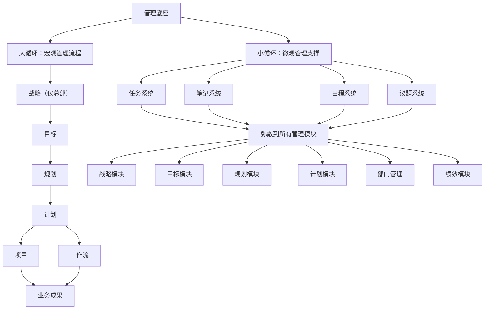
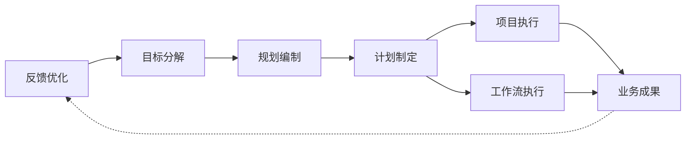
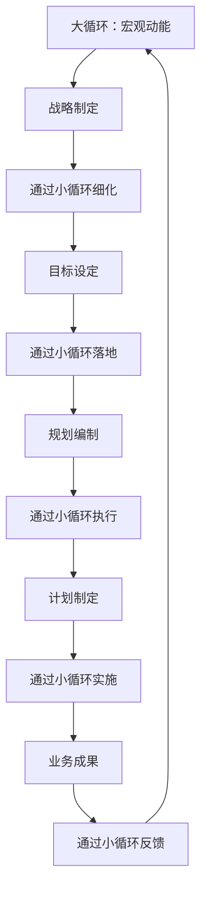

# 双循环管理体系架构深度解析

## 1. 双循环机制：管理思想的精髓

经过深入理解用户指导，我认识到这个管理体系的核心是**双循环机制**：大循环负责宏观管理的完整流程，小循环负责微观管理的弥散支撑。这两个循环相互交织，构成了一个生生不息的管理生态系统。

### 1.1 双循环架构全景视图



## 2. 大循环：宏观管理流程

### 2.1 大循环的完整路径

大循环是组织宏观管理的骨干流程，实现了从战略构想向业务成果的完整转化：



### 2.2 大循环各环节功能

#### 2.2.1 战略层（仅总部）
- **定位**：组织方向性决策
- **特点**：长期性、宏观性、定性为主
- **输出**：战略意图、发展方向、核心原则

#### 2.2.2 目标层
- **定位**：战略的具体化
- **特点**：中期性、可衡量、定量为主
- **输出**：关键绩效指标、里程碑目标

#### 2.2.3 规划层
- **定位**：目标的实施路径
- **特点**：短期性、路径性、资源导向
- **输出**：实施路线图、资源分配方案

#### 2.2.4 计划层
- **定位**：规划的具体行动
- **特点**：近期性、可操作、时间导向
- **输出**：详细工作计划、责任分配

#### 2.2.5 执行层
- **项目执行**：临时性、创新性工作
- **工作流执行**：标准化、重复性工作
- **输出**：具体的业务成果和价值创造

## 3. 小循环：微观管理支撑

### 3.1 小循环的弥散特性

小循环不是独立的流程，而是**弥散到所有管理模块中的微观管理机制**，通过四个核心要素支撑每个管理活动的落地：

#### 3.1.1 任务系统
- **作用**：将管理活动分解为可执行的动作
- **特点**：具体、可分配、可跟踪
- **示例**：战略制定中的调研任务、目标设定中的数据分析任务

#### 3.1.2 笔记系统
- **作用**：记录管理过程中的思考、发现、经验
- **特点**：知识积累、经验传承、决策支持
- **示例**：规划编制中的方案笔记、目标评估中的总结笔记

#### 3.1.3 日程系统
- **作用**：安排管理活动的时间节点和期限
- **特点**：时间管理、进度控制、优先级排序
- **示例**：战略评审会议日程、目标考核时间安排

#### 3.1.4 议题系统
- **作用**：标识需要讨论、决策的关键问题
- **特点**：问题聚焦、决策支持、风险预警
- **示例**：目标冲突议题、资源分配争议议题

### 3.2 小循环的弥散模式

小循环通过运行模块弥散到各个管理环节中：

```
战略制定（本身就是一个项目）
└── 运行模块（战略制定的小循环）
    ├── 项目（战略制定项目）
    │   ├── 任务（战略分析任务、环境扫描任务）
    │   ├── 议题（战略方向争议、资源约束议题）
    │   ├── 笔记（行业趋势笔记、竞争对手分析笔记）
    │   └── 日程（战略研讨会时间、决策截止日期）
    └── 工作流（战略制定流程）
        ├── 任务（流程各阶段任务）
        ├── 议题（流程阻塞议题）
        ├── 笔记（流程改进笔记）
        └── 日程（流程时间节点）
```

## 4. 双循环交互机制

### 4.1 循环间的能量交换

双循环不是孤立运行，而是通过密切的交互实现管理能量的传递和放大：



### 4.2 大小循环的协同作用

#### 4.2.1 大循环提供方向，小循环提供动力
- **大循环**：设定管理的基本框架和节奏
- **小循环**：在每个环节提供具体的执行能量

#### 4.2.2 大循环确保整体性，小循环确保落地性
- **大循环**：保证各管理环节的连贯性和一致性
- **小循环**：保证每个管理活动的具体性和可操作性

#### 4.2.3 大循环关注结果，小循环关注过程
- **大循环**：聚焦最终的业务成果和价值创造
- **小循环**：关注管理过程的质量和效率

## 5. 部门级双循环实现

### 5.1 部门级大循环适配

每个部门在总部大循环的框架下，建立适合自己的大循环变体：

```
软件部门大循环
├── 部门战略（承接总部战略）
├── 部门目标（技术目标、产品目标）
├── 部门规划（技术规划、研发规划）
├── 部门计划（开发计划、测试计划）
├── 部门项目（技术项目、产品项目）
└── 部门工作流（开发流程、运维流程）
```

### 5.2 部门级小循环弥散

小循环在部门内部进一步弥散，支撑部门各管理模块：

```
软件部门
├── 目标管理模块
│   └── 运行模块（目标管理的小循环）
│       ├── 任务（目标制定任务、目标跟踪任务）
│       ├── 议题（目标冲突议题、资源分配议题）
│       ├── 笔记（目标达成笔记、问题分析笔记）
│       └── 日程（目标评审日程、考核时间）
├── 规划管理模块
│   └── 运行模块（规划管理的小循环）
│       ├── 任务（规划编制任务、资源规划任务）
│       ├── 议题（技术选型议题、架构争议议题）
│       ├── 笔记（技术评估笔记、方案比较笔记）
│       └── 日程（规划评审日程、里程碑时间）
└── 计划管理模块
    └── 运行模块（计划管理的小循环）
        ├── 任务（计划分解任务、进度跟踪任务）
        ├── 议题（工期冲突议题、依赖关系议题）
        ├── 笔记（进度记录笔记、风险识别笔记）
        └── 日程（计划评审日程、交付时间）
```

## 6. 双循环架构的设计智慧

### 6.1 生生不息的系统特性

#### 6.1.1 能量持续流动
- **大循环**：提供战略势能，驱动组织向前
- **小循环**：提供执行动能，确保步步落地
- **反馈机制**：成果反馈优化战略，形成闭环

#### 6.1.2 自适应调节
- **大循环调节**：根据环境变化调整战略方向
- **小循环调节**：根据执行情况优化管理过程
- **协同调节**：大小循环相互适应，保持系统平衡

#### 6.1.3 韧性增强
- **大循环韧性**：战略框架的稳定性抵御外部冲击
- **小循环韧性**：微观管理的灵活性适应内部变化
- **系统韧性**：双循环协同增强整体抗风险能力

### 6.2 管理科学的升华

#### 6.2.1 从线性思维到系统思维
- **传统管理**：线性流程，单向传递
- **双循环管理**：系统互动，双向反馈
- **思维升级**：从机械观到生态观的转变

#### 6.2.2 从控制到赋能
- **大循环**：提供框架和方向，而非详细控制
- **小循环**：提供工具和支持，而非严格约束
- **管理哲学**：从控制员工到赋能团队

#### 6.2.3 从静态到动态
- **静态管理**：固定流程，僵化执行
- **动态管理**：自适应流程，灵活调整
- **管理演进**：从标准化到情境化的进步

## 7. 双循环架构的实施价值

### 7.1 组织效能提升

#### 7.1.1 战略落地能力
- **大循环确保**：战略能够完整传递到执行层
- **小循环确保**：每个战略环节都有具体支撑
- **综合效果**：战略不再停留在纸上，而是真正落地

#### 7.1.2 执行精准度
- **大循环提供**：清晰的目标和路径
- **小循环提供**：具体的行动和跟踪
- **综合效果**：执行更加精准，减少偏差和浪费

#### 7.1.3 学习进化能力
- **大循环学习**：从成果反馈中优化战略
- **小循环学习**：从过程记录中积累经验
- **综合效果**：组织持续学习和进化

### 7.2 管理成熟度提升

#### 7.2.1 流程成熟度
- **标准化**：通过小循环实现管理过程的标准化
- **可重复**：通过大循环确保管理流程的可重复性
- **可优化**：通过双循环反馈实现持续改进

#### 7.2.2 人员成熟度
- **能力提升**：员工在双循环中锻炼综合能力
- **责任明确**：大小循环的清晰界定促进责任落实
- **主动性增强**：小循环的自主性激发员工主动性

#### 7.2.3 技术成熟度
- **工具支撑**：双循环机制需要相应的技术工具
- **数据积累**：通过小循环积累宝贵的管理数据
- **智能化基础**：为AI驱动的管理优化奠定基础

## 8. 未来演进方向

### 8.1 智能化双循环

#### 8.1.1 AI增强的大循环
- **智能战略**：AI辅助的战略分析和决策
- **预测性目标**：基于数据的智能目标设定
- **自适应规划**：实时调整的智能规划系统

#### 8.1.2 AI增强的小循环
- **智能任务分配**：AI优化的任务分配和调度
- **知识自动提取**：从笔记中自动提取知识
- **智能日程优化**：AI驱动的日程安排和冲突解决

### 8.2 生态化扩展

#### 8.2.1 供应链双循环
- 将双循环机制扩展到供应商管理
- 实现供应链的协同战略和执行

#### 8.2.2 客户生态双循环
- 将客户纳入管理双循环
- 实现需求与供给的精准匹配

#### 8.2.3 产业协同双循环
- 跨组织的双循环协同
- 产业生态的共同进化和价值创造

## 9. 实施路线图

### 9.1 阶段一：基础双循环建立


### 9.2 阶段二：全面双循环推广
- 将双循环机制推广到所有部门
- 建立跨部门协同机制
- 完善双循环的度量体系

### 9.3 阶段三：智能双循环进化
- 引入AI技术增强双循环
- 建立预测性管理能力
- 实现自适应的组织进化

## 10. 总结

双循环管理体系架构代表了**管理思想的重大突破**，它通过大循环和小循环的巧妙结合，解决了传统管理中战略与执行脱节、宏观与微观割裂的核心问题。

### 10.1 核心突破点

1. **机制创新**：大循环保证战略落地完整性，小循环保证执行过程精细度
2. **哲学升华**：从控制到赋能，从线性到系统，从静态到动态
3. **实践价值**：显著提升组织效能、管理成熟度和学习进化能力

### 10.2 深远影响

这个架构不仅是一个管理体系，更是一个**组织进化引擎**。它通过双循环的持续运转，驱动组织不断适应环境变化、积累知识经验、提升能力水平，最终实现可持续的高绩效发展。

双循环机制的精髓在于它的**生生不息**——大循环提供方向和框架，小循环提供动力和支撑，两者相互促进、相互滋养，共同构建了一个充满活力的管理生态系统。这不仅是管理技术的进步，更是组织生命力的体现。