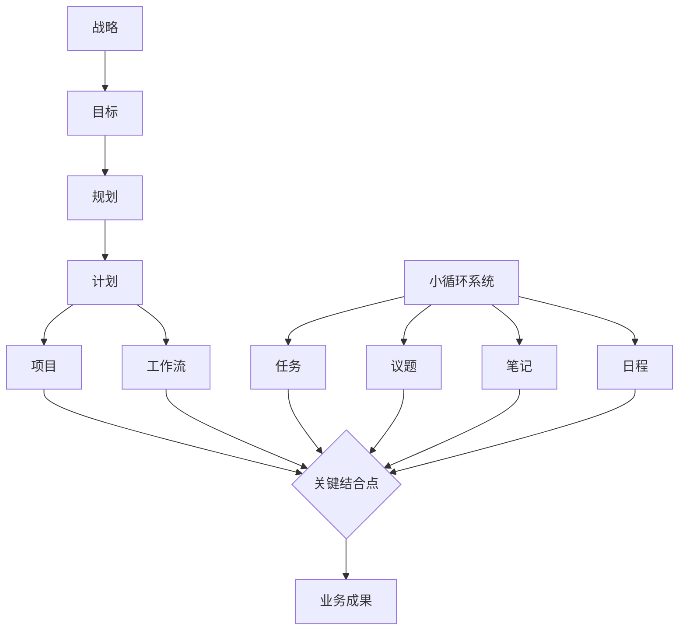
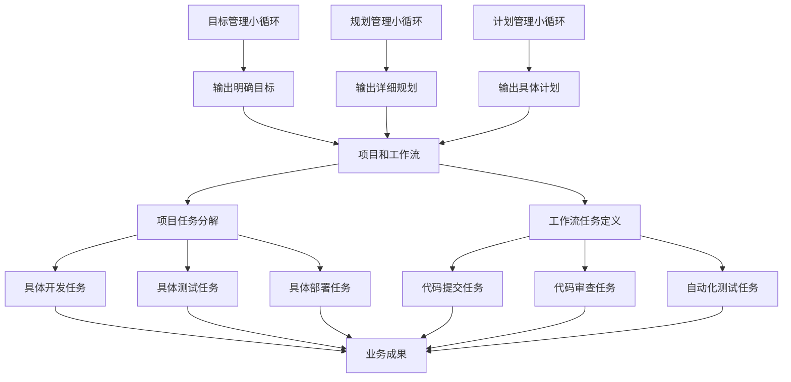

# 管理体系关键结合点深度解析

## 1. 核心洞察：项目和工作流是关键结合点

经过深入反思用户指导，我认识到在双循环管理体系中，**项目和工作流是唯一真正实现大循环与小循环结合的落地节点**。这个结合点的理解程度直接决定了整个管理体系的有效性。

### 1.1 结合点的战略地位



**关键洞察**：大循环的其他部分（战略、目标、规划、计划）和小循环本身都是概念性的，只有通过项目和工作流与小循环的结合，才能真正实现从概念到现实的转化。

## 2. 结合点的运作机制

### 2.1 项目与小循环的结合

#### 2.1.1 项目拆解为小循环要素

```
项目（大循环节点）
├── 任务（小循环要素）
│   ├── 具体动作：将项目目标分解为可执行的任务
│   ├── 责任分配：明确每个任务的负责人
│   ├── 时间要求：设定任务的开始和结束时间
│   └── 完成标准：定义任务完成的验收标准
├── 议题（小循环要素）
│   ├── 问题识别：项目执行中遇到的问题
│   ├── 决策需求：需要集体决策的事项
│   ├── 风险预警：可能影响项目成功的风险
│   └── 变更请求：项目范围或计划的变更
├── 笔记（小循环要素）
│   ├── 经验记录：项目执行中的经验教训
│   ├── 知识积累：项目相关的专业知识
│   ├── 过程跟踪：项目进展的详细记录
│   └── 最佳实践：项目中形成的有效方法
└── 日程（小循环要素）
    ├── 会议安排：项目相关的会议时间
    ├── 里程碑：关键节点的时间安排
    ├── 交付时间：成果交付的时间点
    └── 评审时间：项目评审的时间安排
```

#### 2.1.2 结合点的落地价值

- **从抽象到具体**：将抽象的项目目标转化为具体的可执行动作
- **从计划到行动**：将项目计划转化为实际的日程安排
- **从问题到解决**：通过议题机制将问题转化为决策和行动
- **从经验到知识**：通过笔记机制将个人经验转化为组织知识

### 2.2 工作流与小循环的结合

#### 2.2.1 工作流的小循环支撑

```
工作流（大循环节点）
├── 任务（小循环要素）
│   ├── 流程步骤：工作流中的每个步骤任务
│   ├── 自动化：可自动执行的任务
│   ├── 人工干预：需要人工处理的任务
│   └── 异常处理：流程异常时的处理任务
├── 议题（小循环要素）
│   ├── 流程优化：工作流改进的讨论
│   ├── 瓶颈识别：流程中的阻塞点
│   ├── 效率提升：提高流程效率的建议
│   └── 质量问题：流程输出质量的问题
├── 笔记（小循环要素）
│   ├── 流程文档：工作流的详细说明
│   ├── 操作指南：具体操作步骤的指导
│   ├── 问题解决：常见问题的解决方法
│   └── 改进记录：流程优化的历史记录
└── 日程（小循环要素）
    ├── 执行时间：工作流执行的时间安排
    ├── 监控周期：流程监控的频率
    ├── 评审周期：流程评审的时间安排
    └── 优化周期：流程优化的时间节点
```

#### 2.2.2 结合点的标准化价值

- **流程固化**：将最佳实践固化为标准工作流
- **质量保证**：通过标准化流程确保输出质量
- **效率提升**：消除不必要的重复和浪费
- **经验传承**：新员工可以快速掌握工作方法

## 3. 软件部门结合点的完整实现

### 3.1 软件部门大循环与小循环的完整结合

```
软件部门
├── 目标管理模块
│   └── 运行模块（目标管理的小循环）
│       ├── 任务（目标制定、跟踪任务）
│       ├── 议题（目标冲突、资源分配议题）
│       ├── 笔记（目标达成、问题分析笔记）
│       └── 日程（目标评审、考核时间）
├── 规划管理模块
│   └── 运行模块（规划管理的小循环）
│       ├── 任务（规划编制、资源规划任务）
│       ├── 议题（技术选型、架构争议议题）
│       ├── 笔记（技术评估、方案比较笔记）
│       └── 日程（规划评审、里程碑时间）
├── 计划管理模块
│   └── 运行模块（计划管理的小循环）
│       ├── 任务（计划分解、进度跟踪任务）
│       ├── 议题（工期冲突、依赖关系议题）
│       ├── 笔记（进度记录、风险识别笔记）
│       └── 日程（计划评审、交付时间）
├── 项目（大循环节点，与小循环结合）
│   ├── 任务（开发任务、测试任务、部署任务）
│   ├── 议题（技术难题、需求变更、资源不足）
│   ├── 笔记（架构设计、代码规范、部署记录）
│   └── 日程（迭代周期、发布计划、评审会议）
└── 工作流（大循环节点，与小循环结合）
    ├── 任务（代码提交、代码审查、自动化测试）
    ├── 议题（流程阻塞、质量下降、效率问题）
    ├── 笔记（流程改进、工具使用、最佳实践）
    └── 日程（每日构建、每周发布、每月评审）
```

### 3.2 结合点的能量转化过程



## 4. 结合点的重大意义

### 4.1 管理体系落地的唯一通道

**核心观点**：项目和工作流是管理体系从概念世界通向现实世界的唯一桥梁。

#### 4.1.1 概念世界的局限性
- 战略、目标、规划、计划都是概念性的
- 小循环的任务、议题、笔记、日程也是概念性的
- 只有通过项目和工作流的结合，这些概念才能转化为现实

#### 4.1.2 现实世界的唯一入口
- **项目**：将战略意图转化为具体的产品和服务
- **工作流**：将管理理念转化为标准化的操作流程
- **结合点**：将管理思想转化为实际的生产力

### 4.2 价值创造的实际发生地

#### 4.2.1 从管理成本到价值创造
- **管理成本**：战略制定、目标设定、规划编制、计划制定
- **价值创造**：项目交付的产品、工作流提供的服务
- **转化节点**：项目和工作流是成本向价值转化的关键点

#### 4.2.2 从投入产出角度看结合点
```
投入：管理资源（时间、人力、资金）
    ↓
过程：战略→目标→规划→计划
    ↓
转化：项目和工作流（结合点）
    ↓
产出：业务成果（产品、服务、价值）
```

### 4.3 组织能力的真实体现

#### 4.3.1 管理能力的试金石
- **战略能力**：通过项目选择和执行体现
- **执行能力**：通过工作流效率和质量体现
- **学习能力**：通过项目经验和工作流优化体现

#### 4.3.2 组织成熟度的标志
- **初级组织**：重视战略制定，忽视项目执行
- **中级组织**：关注项目执行，忽视工作流优化
- **高级组织**：在项目和工作流结合点上持续改进

## 5. 结合点的优化策略

### 5.1 项目与小循环结合的优化

#### 5.1.1 任务分解的精细化
- **粒度控制**：任务大小适中，既不太大也不太小
- **依赖管理**：明确任务间的依赖关系
- **资源匹配**：任务与执行资源的精准匹配

#### 5.1.2 议题管理的有效性
- **问题分类**：建立标准的问题分类体系
- **决策机制**：明确的决策流程和责任人
- **闭环管理**：确保每个议题都有明确的处理结果

#### 5.1.3 笔记系统的价值化
- **知识提取**：从笔记中提取有价值的经验
- **模式识别**：发现项目执行中的规律和模式
- **最佳实践**：形成可复用的工作方法

#### 5.1.4 日程安排的合理性
- **时间估算**：基于历史数据的准确时间估算
- **缓冲设置**：合理的缓冲时间应对不确定性
- **优先级管理**：基于价值的重要紧急度排序

### 5.2 工作流与小循环结合的优化

#### 5.2.1 流程任务的自动化
- **识别机会**：识别可自动化的重复性任务
- **工具选择**：选择合适的自动化工具
- **效果评估**：评估自动化带来的效率提升

#### 5.2.2 流程议题的预防性
- **根本原因分析**：深入分析流程问题的根本原因
- **预防措施**：建立问题预防机制
- **持续改进**：基于议题的流程持续优化

#### 5.2.3 流程笔记的系统化
- **标准操作程序**：形成标准化的操作指南
- **故障处理手册**：建立常见问题的解决方法库
- **改进日志**：记录流程优化的过程和效果

#### 5.2.4 流程日程的节奏化
- **执行节奏**：建立稳定的流程执行节奏
- **监控频率**：设定合理的流程监控频率
- **评审周期**：定期的流程评审和改进

## 6. 结合点的度量与改进

### 6.1 关键度量指标

#### 6.1.1 项目结合点度量
- **任务完成率**：项目任务按时完成的比例
- **议题解决时间**：从议题提出到解决的平均时间
- **知识复用率**：项目笔记被其他项目引用的频率
- **日程遵守率**：项目日程的实际遵守程度

#### 6.1.2 工作流结合点度量
- **流程效率**：工作流执行的时间效率
- **流程质量**：工作流输出的质量指标
- **流程适应性**：工作流应对变化的灵活性
- **流程满意度**：使用者对工作流的满意度

### 6.2 持续改进机制

#### 6.2.1 基于数据的改进
- **数据分析**：分析结合点的度量数据
- **问题识别**：识别结合点中的瓶颈和问题
- **改进实验**：设计并实施改进措施
- **效果评估**：评估改进措施的效果

#### 6.2.2 基于反馈的改进
- **用户反馈**：收集项目和工作流使用者的反馈
- **经验分享**：组织结合点最佳实践的分享
- **跨部门学习**：学习其他部门的成功经验
- **外部对标**：与行业最佳实践进行对标

## 7. 结合点的未来演进

### 7.1 智能化结合点

#### 7.1.1 AI增强的项目管理
- **智能任务分配**：基于能力和工作量的智能分配
- **风险预测**：基于历史数据的项目风险预测
- **资源优化**：AI驱动的资源分配优化

#### 7.1.2 自适应工作流
- **情境感知**：根据上下文自动调整工作流
- **个性化适配**：根据使用者特点个性化工作流
- **自学习优化**：基于执行数据自动优化工作流

### 7.2 生态化结合点

#### 7.2.1 跨组织项目协同
- 供应商参与的项目管理
- 客户参与的需求管理
- 合作伙伴参与的创新项目

#### 7.2.2 产业级工作流集成
- 跨企业的工作流标准
- 产业生态的流程协同
- 价值链的端到端优化

## 8. 实施建议

### 8.1 重点投入结合点建设

#### 8.1.1 资源倾斜
- **人才投入**：在项目和工作流管理上投入优秀人才
- **工具投入**：提供先进的项目和工作流管理工具
- **培训投入**：加强结合点相关技能的培训

#### 8.1.2 政策支持
- **激励机制**：建立基于结合点效果的激励机制
- **考核导向**：将结合点效果纳入绩效考核
- **文化塑造**：培育重视落地执行的组织文化

### 8.2 分阶段推进策略

#### 8.2.1 阶段一：基础结合点建立
- 建立标准的项目和工作流管理流程
- 培训基本的结合点管理技能
- 建立基础的度量体系

#### 8.2.2 阶段二：结合点优化
- 基于数据进行结合点优化
- 引入先进的管理工具和方法
- 建立持续改进机制

#### 8.2.3 阶段三：结合点创新
- 探索智能化的结合点管理
- 建立生态化的协同机制
- 形成组织核心竞争优势

## 9. 总结

项目和工作流作为大循环与小循环的关键结合点，是整个管理体系的**心脏和引擎**。这个结合点的理解深度和实施效果，直接决定了管理体系的价值和生命力。

### 9.1 核心价值重述

1. **唯一落地通道**：只有通过项目和工作流，管理体系才能从概念走向现实
2. **价值创造节点**：管理投入在这里转化为业务价值
3. **能力体现场所**：组织战略能力、执行能力、学习能力在这里真实体现
4. **改进杠杆点**：优化结合点的效果远大于优化其他环节

### 9.2 行动号召

**重视结合点、投资结合点、优化结合点**应该成为组织管理的核心策略。只有在这个关键节点上取得突破，整个管理体系才能真正发挥其应有的价值，推动组织持续成长和进化。

结合点不是管理体系的一个普通组成部分，而是**管理体系的生命线**。理解这一点，就理解了现代组织管理的精髓。