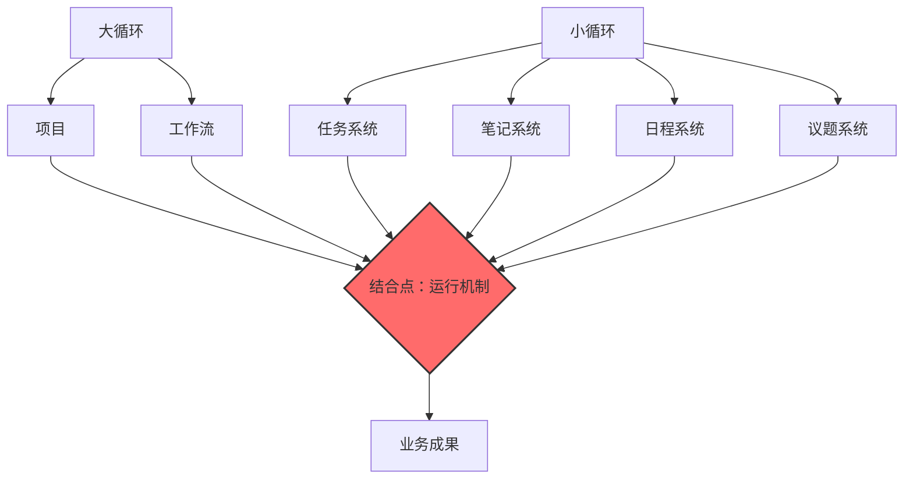
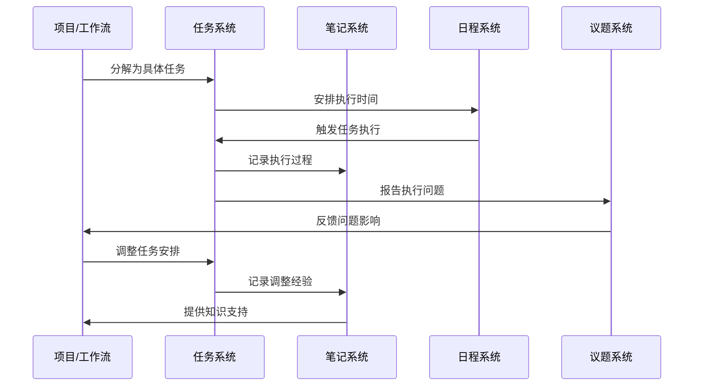

# 管理体系结合点运行机制深度解析

## 1. 重新定义：结合点的本质是运行机制

经过深入反思用户指导，我认识到之前的理解仍有偏差。**结合点的本质不是项目和工作流本身，而是项目和工作流与小循环共同构成的整体运行机制**。这个运行机制的顺畅程度决定了管理体系落地的质量。

### 1.1 结合点的正确理解



**核心洞察**：结合点是一个**动态的运行机制**，而不是静态的节点。它包括：
- **项目/工作流**（大循环的载体）
- **小循环系统**（任务、笔记、日程、议题）
- **两者之间的协同运行关系**

## 2. 结合点运行机制的三维模型

### 2.1 结构维度：要素组合

```
结合点运行机制 = 
   项目/工作流（大循环载体）
   + 
   小循环系统（任务、笔记、日程、议题）
   +
   协同运行规则
```

#### 2.1.1 大循环载体的角色
- **项目**：承载创新性、临时性工作
- **工作流**：承载标准化、重复性工作
- **共同特点**：都需要小循环系统的支撑才能有效运行

#### 2.1.2 小循环系统的支撑
- **任务系统**：将项目/工作流分解为可执行动作
- **笔记系统**：记录执行过程中的知识和经验
- **日程系统**：安排执行的时间节点
- **议题系统**：处理执行中的问题和决策

#### 2.1.3 协同运行规则
- **信息流动规则**：数据在小循环要素间的传递方式
- **状态同步规则**：各要素状态的协调机制
- **优先级规则**：冲突时的决策原则
- **反馈规则**：执行结果的反馈路径

### 2.2 过程维度：运行流程



### 2.3 效果维度：运行质量

#### 2.3.1 运行顺畅度指标
- **任务流转效率**：任务从创建到完成的平均时间
- **问题响应速度**：议题从提出到解决的时间
- **知识复用率**：笔记被其他项目引用的频率
- **时间遵守率**：日程安排的实际执行程度

#### 2.3.2 运行质量影响
- **高质运行**：结合点机制顺畅 → 落地效果好
- **低质运行**：结合点机制阻塞 → 落地效果差

## 3. 结合点运行机制的关键特性

### 3.1 双向互动性

#### 3.1.1 大循环到小循环的分解
```
项目目标
    ↓（分解）
具体任务（任务系统）
    ↓（安排）
时间节点（日程系统）
    ↓（记录）
执行过程（笔记系统）
    ↓（处理）
执行问题（议题系统）
```

#### 3.1.2 小循环到大循环的反馈
```
执行问题（议题系统）
    ↓（反馈）
项目调整（项目系统）
    ↓（积累）
经验知识（笔记系统）
    ↓（优化）
未来规划（规划系统）
    ↓（改进）
战略方向（战略系统）
```

### 3.2 自适应性

#### 3.2.1 基于反馈的调整
- **任务调整**：根据执行情况动态调整任务
- **日程重排**：根据进度变化重新安排时间
- **知识应用**：根据历史经验优化当前执行
- **问题预防**：根据过往问题建立预防机制

#### 3.2.2 基于学习的优化
- **模式识别**：从成功案例中识别有效模式
- **最佳实践**：形成可复用的工作方法
- **流程改进**：持续优化结合点运行流程
- **工具升级**：引入更有效的管理工具

### 3.3 规模化扩展性

#### 3.3.1 单个结合点的深度运行
```
软件开发项目结合点
├── 任务系统：代码开发、测试、部署任务
├── 笔记系统：架构设计、代码规范、问题解决
├── 日程系统：迭代周期、发布计划、评审时间
└── 议题系统：技术难题、需求变更、资源冲突
```

#### 3.3.2 多个结合点的协同运行
```
软件部门多项目协同
├── 项目A结合点
│   ├── 任务系统（与项目B任务协调）
│   ├── 笔记系统（共享技术文档）
│   ├── 日程系统（统一发布时间）
│   └── 议题系统（协调资源冲突）
├── 项目B结合点
│   ├── 任务系统（与项目A任务协调）
│   ├── 笔记系统（共享最佳实践）
│   ├── 日程系统（避免时间冲突）
│   └── 议题系统（协同问题解决）
└── 部门工作流结合点
    ├── 任务系统（标准化流程任务）
    ├── 笔记系统（流程改进记录）
    ├── 日程系统（流程执行时间）
    └── 议题系统（流程优化讨论）
```

## 4. 结合点运行机制的落地价值

### 4.1 从概念到现实的转化机制

#### 4.1.1 转化过程的三重保障
- **结构保障**：通过任务系统确保动作具体化
- **时间保障**：通过日程系统确保执行及时性
- **知识保障**：通过笔记系统确保经验传承性
- **问题保障**：通过议题系统确保障碍清除性

#### 4.1.2 转化质量的决定因素
```
转化质量 = f(任务分解质量, 时间安排合理性, 知识应用程度, 问题处理效率)
```

### 4.2 管理能量的放大效应

#### 4.2.1 能量输入
- **战略能量**：来自大循环的方向性指引
- **执行能量**：来自小循环的具体性支撑

#### 4.2.2 能量转化
- **结合点机制**：将战略能量转化为执行能量
- **运行质量**：决定能量转化的效率

#### 4.2.3 能量输出
- **业务成果**：转化后的能量体现
- **组织能力**：过程中积累的内在能量

### 4.3 组织学习的加速器

#### 4.3.1 显性知识积累
- **过程记录**：通过笔记系统记录执行过程
- **问题解决**：通过议题系统积累解决方案
- **最佳实践**：通过任务系统固化有效方法

#### 4.3.2 隐性知识显性化
- **经验转化**：将个人经验转化为组织知识
- **模式识别**：从多个项目中识别成功模式
- **能力建设**：通过机制运行提升组织能力

## 5. 结合点运行机制的优化策略

### 5.1 机制顺畅度优化

#### 5.1.1 信息流优化
- **标准化接口**：建立标准的数据交换格式
- **自动化流转**：减少人工干预的信息传递
- **实时同步**：确保各要素状态的实时一致性

#### 5.1.2 决策效率优化
- **权限清晰**：明确各层级的决策权限
- **流程简化**：减少不必要的审批环节
- **工具支持**：提供高效的决策支持工具

### 5.2 机制适应性优化

#### 5.2.1 灵活性设计
- **可配置规则**：支持根据不同情境调整运行规则
- **模块化组合**：支持按需组合小循环要素
- **渐进式改进**：支持基于反馈的持续优化

#### 5.2.2 容错性设计
- **异常处理**：建立标准的异常处理流程
- **恢复机制**：确保机制故障后的快速恢复
- **学习改进**：从机制故障中学习改进

### 5.3 机制扩展性优化

#### 5.3.1 横向扩展
- **模板化**：建立标准化的结合点运行模板
- **复制机制**：支持成功模式的快速复制
- **协同规则**：建立多个结合点间的协同规则

#### 5.3.2 纵向深化
- **专业化**：针对不同类型工作深化专业支持
- **智能化**：引入AI技术提升运行效率
- **生态化**：建立内外部结合的运行生态

## 6. 结合点运行机制的度量体系

### 6.1 运行效率度量

#### 6.1.1 时间效率指标
- **任务周转时间**：从创建到完成的平均时间
- **问题解决时间**：从提出到解决的平均时间
- **决策响应时间**：从需求到决策的平均时间

#### 6.1.2 资源效率指标
- **人力利用率**：任务执行中的人力投入效率
- **工具使用率**：管理工具的实际使用程度
- **知识复用率**：积累知识的实际应用频率

### 6.2 运行质量度量

#### 6.2.1 过程质量指标
- **任务完成率**：计划任务的实际完成比例
- **日程遵守率**：计划时间的实际遵守程度
- **问题关闭率**：提出问题的有效解决比例

#### 6.2.2 结果质量指标
- **项目成功率**：项目目标的达成程度
- **工作流效率**：流程执行的时间和质量
- **用户满意度**：内外用户对成果的满意度

### 6.3 运行改进度量

#### 6.3.1 学习能力指标
- **改进建议数**：提出的改进建议数量
- **改进实施率**：改进建议的实际实施比例
- **改进效果**：改进措施带来的实际效果

#### 6.3.2 适应能力指标
- **变化响应速度**：应对外部变化的速度
- **机制调整频率**：运行机制的实际调整次数
- **调整效果**：机制调整带来的改善程度

## 7. 结合点运行机制的演进方向

### 7.1 智能化演进

#### 7.1.1 AI增强的运行机制
- **智能任务分配**：基于能力和负载的自动分配
- **预测性调度**：基于历史数据的智能日程安排
- **知识自动提取**：从笔记中自动提取有价值知识
- **问题自动分类**：智能识别和分类执行问题

#### 7.1.2 自适应运行机制
- **情境感知**：根据环境变化自动调整运行规则
- **个性化适配**：根据团队特点个性化运行机制
- **自学习优化**：基于运行数据自动优化机制

### 7.2 生态化演进

#### 7.2.1 内部生态整合
- **跨部门协同**：不同部门结合点间的协同运行
- **层级间衔接**：不同层级结合点间的顺畅衔接
- **功能间集成**：不同功能结合点间的深度集成

#### 7.2.2 外部生态扩展
- **供应商整合**：将供应商纳入结合点运行机制
- **客户参与**：让客户参与相关结合点的运行
- **伙伴协同**：与合作伙伴建立协同运行机制

## 8. 实施建议

### 8.1 机制建设优先

#### 8.1.1 从机制角度思考
- **不要只关注工具**：工具是手段，机制是目的
- **不要只关注流程**：流程是框架，机制是灵魂
- **不要只关注结果**：结果是产出，机制是能力

#### 8.1.2 机制建设步骤
1. **理解现有机制**：分析当前结合点的实际运行情况
2. **设计目标机制**：基于业务需求设计理想的运行机制
3. **渐进式改进**：通过小步快跑的方式持续优化机制
4. **制度化固化**：将有效的运行机制固化为组织标准

### 8.2 文化配套支持

#### 8.2.1 机制思维文化
- **系统性思考**：培养从机制角度思考问题的习惯
- **持续改进**：建立基于反馈的持续改进文化
- **协同共享**：培育跨团队协同和知识共享文化

#### 8.2.2 机制执行文化
- **规则遵守**：强化对运行规则的尊重和遵守
- **主动反馈**：鼓励对机制问题的主动反馈
- **责任担当**：培养对机制运行结果的责任感

## 9. 总结

结合点运行机制是管理体系落地的**核心引擎**，它决定了战略意图能否有效转化为业务成果。正确理解这个机制的关键在于：

### 9.1 机制思维的重要性

- **从节点思维到机制思维**：结合点不是静态的交叉点，而是动态的运行机制
- **从要素思维到关系思维**：重要的不是单个要素，而是要素间的协同关系
- **从结果思维到过程思维**：落地效果取决于运行过程的质量

### 9.2 机制优化的杠杆效应

优化结合点运行机制具有**四两拨千斤**的效果：
- 小投入带来大回报
- 局部优化带动整体提升
- 短期改进产生长期价值

### 9.3 持续进化的生命力

结合点运行机制不是一成不变的，而是需要**持续进化**的：
- 基于实践反馈不断优化
- 适应环境变化动态调整
- 拥抱技术创新持续升级

真正优秀的组织，不是拥有完美的战略或先进的管理工具，而是建立了**高效运转的结合点运行机制**。这个机制就像组织的神经系统，确保大脑的指令能够准确传达到四肢，并协调一致地行动。

理解这一点，就理解了现代组织管理的真谛。