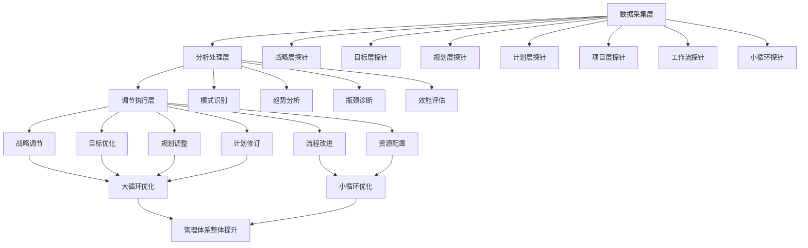
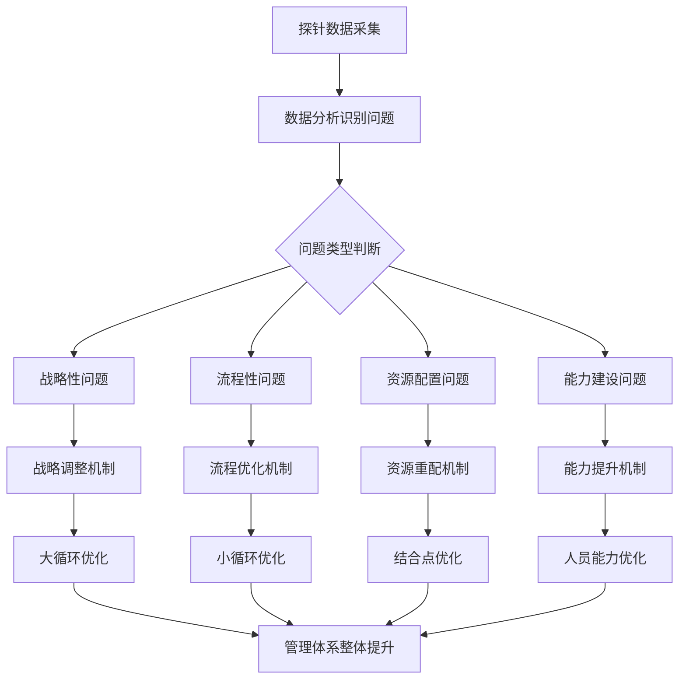

# 管理体系自适应体系建设深度解析

## 1. 自适应体系：管理体系的第二个亮点

在深入理解双循环机制的基础上，我们认识到自适应体系是整个管理架构的**第二个核心亮点**。它通过探针采集、信息分析、动态调节机制，实现了管理体系的自我优化和持续进化。

### 1.1 自适应体系的三层架构



## 2. 探针采集机制

### 2.1 探针系统的设计原则

#### 2.1.1 全面覆盖原则
- **战略层探针**：采集战略决策的相关数据
- **执行层探针**：采集具体执行的过程数据
- **结果层探针**：采集业务成果的产出数据
- **环境层探针**：采集外部环境的变化数据

#### 2.1.2 无干扰原则
- **嵌入式设计**：探针嵌入到正常业务流程中
- **自动化采集**：减少人工干预，避免影响正常工作
- **实时性保障**：确保数据的及时性和准确性

### 2.2 关键探针部署点

#### 2.2.1 大循环探针部署

```
战略层探针
├── 战略制定过程数据
├── 战略决策依据数据
├── 战略调整频率数据
└── 战略执行偏差数据

目标层探针
├── 目标设定合理性数据
├── 目标达成进度数据
├── 目标调整频率数据
└── 目标冲突识别数据

规划层探针
├── 规划编制效率数据
├── 资源分配合理性数据
├── 规划执行偏差数据
└── 规划调整适应性数据

计划层探针
├── 计划分解粒度数据
├── 任务分配合理性数据
├── 进度跟踪准确性数据
└── 计划变更频率数据

项目层探针
├── 项目启动效率数据
├── 项目执行进度数据
├── 项目质量问题数据
└── 项目成果质量数据

工作流探针
├── 流程执行效率数据
├── 流程质量问题数据
├── 流程阻塞识别数据
└── 流程优化效果数据
```

#### 2.2.2 小循环探针部署

```
任务系统探针
├── 任务创建频率数据
├── 任务完成时效数据
├── 任务质量评估数据
└── 任务依赖关系数据

笔记系统探针
├── 笔记创建频率数据
├── 笔记引用次数数据
├── 知识沉淀效果数据
└── 经验复用程度数据

日程系统探针
├── 日程安排合理性数据
├── 时间遵守程度数据
├── 冲突识别频率数据
└── 优先级设置数据

议题系统探针
├── 议题提出频率数据
├── 议题解决时效数据
├── 问题分类分布数据
└── 决策质量评估数据
```

## 3. 信息分析机制

### 3.1 分析维度的设计

#### 3.1.1 效能分析维度
- **时间效能**：各环节的时间利用效率
- **资源效能**：资源配置和利用效率
- **质量效能**：工作成果的质量水平
- **创新效能**：创新能力和改进效果

#### 3.1.2 关联分析维度
- **因果关系分析**：识别问题产生的根本原因
- **相关性分析**：发现各要素间的相互影响
- **趋势分析**：预测未来的发展走向
- **对比分析**：与历史数据或标杆对比

### 3.2 分析方法的运用

#### 3.2.1 定量分析方法
- **统计分析**：描述性统计和推断统计
- **预测分析**：基于历史数据的趋势预测
- **优化分析**：寻找最优的资源配置方案
- **模拟分析**：通过模拟测试不同方案效果

#### 3.2.2 定性分析方法
- **模式识别**：从数据中识别有效的工作模式
- **根因分析**：深入分析问题的根本原因
- **最佳实践提取**：从成功案例中提取有效方法
- **风险识别**：识别潜在的风险和挑战

## 4. 动态调节机制

### 4.1 调节策略的设计

#### 4.1.1 渐进式调节
- **小步快跑**：通过小幅度调整测试效果
- **A/B测试**：对比不同调节方案的效果
- **逐步优化**：基于反馈逐步完善调节策略
- **风险控制**：确保调节过程的风险可控

#### 4.1.2 系统性调节
- **整体优化**：考虑各环节的相互影响
- **优先级排序**：基于影响程度确定调节顺序
- **资源协调**：确保调节所需的资源支持
- **效果评估**：建立调节效果的评估机制

### 4.2 调节执行的路径



## 5. 自适应体系与双循环架构的契合性

### 5.1 架构设计的天然优势

#### 5.1.1 数据采集的便利性
- **结构化数据**：双循环机制天然产生结构化数据
- **标准化接口**：各环节间有清晰的输入输出接口
- **完整链路**：从战略到执行的完整数据链条
- **实时更新**：业务流程的实时性确保数据时效性

#### 5.1.2 调节执行的顺畅性
- **明确路径**：大循环提供了清晰的调节路径
- **快速响应**：小循环确保了调节的快速执行
- **效果验证**：结合点提供了调节效果的验证场所
- **持续改进**：双循环机制支持持续的调节优化

### 5.2 自适应能力的层次化

#### 5.2.1 战术层自适应
- **问题响应**：快速响应执行中的具体问题
- **流程优化**：基于数据优化工作流程
- **资源调配**：根据需求动态调整资源分配
- **质量改进**：持续提升工作成果质量

#### 5.2.2 战略层自适应
- **方向调整**：基于环境变化调整战略方向
- **目标优化**：根据执行情况优化目标设定
- **能力建设**：基于需求规划组织能力建设
- **创新驱动**：推动组织的持续创新发展

## 6. 自适应体系的运行机制

### 6.1 数据驱动的决策机制

#### 6.1.1 决策依据的升级
- **从经验到数据**：基于数据分析而非个人经验
- **从定性到定量**：用量化数据支持定性判断
- **从滞后到实时**：实时数据支持及时决策
- **从局部到全局**：全局数据支持系统决策

#### 6.1.2 决策质量的提升
- **准确性提升**：数据支持更准确的判断
- **及时性提升**：实时数据支持快速决策
- **一致性提升**：数据标准确保决策一致性
- **可追溯性**：数据记录支持决策追溯

### 6.2 闭环优化的改进机制

#### 6.2.1 改进循环的设计
```
数据采集 → 问题识别 → 原因分析 → 方案制定 → 实施执行 → 效果评估 → 数据采集
```

#### 6.2.2 改进效率的提升
- **快速迭代**：短周期的改进循环
- **精准定位**：数据支持问题的精准定位
- **效果量化**：用量化指标评估改进效果
- **经验固化**：将有效改进固化为标准

## 7. 自适应体系的技术支撑

### 7.1 数据基础设施

#### 7.1.1 数据采集技术
- **探针技术**：轻量级的数据采集点
- **接口技术**：标准化的数据交换接口
- **存储技术**：高效可靠的数据存储方案
- **传输技术**：安全快速的数据传输机制

#### 7.1.2 数据处理技术
- **清洗技术**：确保数据质量的清洗机制
- **整合技术**：多源数据的整合处理
- **分析技术**：高效的数据分析算法
- **可视化技术**：直观的数据展示方式

### 7.2 分析决策支持

#### 7.2.1 分析工具
- **统计分析工具**：支持各种统计分析需求
- **预测分析工具**：基于数据的趋势预测
- **优化分析工具**：寻找最优解决方案
- **模拟分析工具**：测试不同方案的效果

#### 7.2.2 决策支持
- **预警系统**：及时发现潜在问题
- **推荐系统**：提供优化建议和方案
- **模拟系统**：预测决策可能的影响
- **评估系统**：评估决策的实际效果

## 8. 自适应体系的实施路径

### 8.1 分阶段建设策略

#### 8.1.1 阶段一：基础数据建设


#### 8.1.2 阶段二：分析能力建设
- 建立基础分析模型
- 开发分析工具和仪表板
- 培训数据分析能力
- 建立分析决策流程

#### 8.1.3 阶段三：调节机制建设
- 设计调节策略和规则
- 建立调节执行机制
- 测试调节效果评估
- 优化调节反馈循环

### 8.2 关键成功因素

#### 8.2.1 组织文化因素
- **数据文化**：培养基于数据决策的文化
- **学习文化**：鼓励从数据中学习和改进
- **透明文化**：建立数据共享和透明度
- **创新文化**：支持基于数据的创新尝试

#### 8.2.2 技术能力因素
- **数据素养**：提升全员的数据理解能力
- **分析能力**：培养专业的分析人才
- **工具使用**：熟练掌握分析工具的使用
- **系统思维**：培养系统性的分析思维

#### 8.2.3 管理机制因素
- **激励机制**：建立基于数据的绩效激励
- **协作机制**：促进跨部门的数据协作
- **培训机制**：建立持续的数据能力培训
- **评估机制**：定期评估自适应体系效果

## 9. 自适应体系的价值体现

### 9.1 管理效能的显著提升

#### 9.1.1 决策质量提升
- **准确性提升**：数据支持的决策更准确
- **及时性提升**：实时数据支持快速决策
- **一致性提升**：标准数据确保决策一致
- **可追溯性**：完整记录支持决策追溯

#### 9.1.2 执行效率提升
- **问题发现更快**：实时探针及时发现问题
- **解决方案更优**：数据分析提供优化方案
- **资源利用更高**：基于数据的资源优化
- **质量水平更稳**：持续监控确保质量稳定

### 9.2 组织能力的持续进化

#### 9.2.1 学习能力提升
- **经验积累**：系统记录和积累组织经验
- **模式识别**：从数据中识别有效工作模式
- **知识转化**：将隐性知识转化为显性知识
- **能力建设**：基于数据规划能力建设

#### 9.2.2 适应能力提升
- **环境感知**：及时感知外部环境变化
- **快速响应**：基于数据的快速响应能力
- **灵活调整**：根据情况灵活调整策略
- **持续优化**：建立持续优化的机制

### 9.3 竞争优势的建立

#### 9.3.1 运营优势
- **效率优势**：更高的运营效率
- **质量优势**：更稳定的质量水平
- **成本优势**：更优的成本控制
- **创新优势**：更强的创新能力

#### 9.3.2 战略优势
- **预见性优势**：基于数据的趋势预见
- **适应性优势**：快速适应环境变化
- **学习性优势**：持续学习和改进能力
- **系统性优势**：整体优化的系统能力

## 10. 总结

自适应体系是双循环管理架构的**第二个核心亮点**，它通过探针采集、信息分析、动态调节机制，实现了管理体系的自我优化和持续进化。

### 10.1 体系设计的精妙之处

1. **数据驱动**：将管理从经验驱动升级为数据驱动
2. **闭环优化**：建立了完整的改进闭环机制
3. **层次适配**：实现了战术层和战略层的分层自适应
4. **持续进化**：支持组织的持续学习和改进

### 10.2 实施价值的关键认知

- **不是技术问题**：自适应体系的核心是机制而非技术
- **不是附加功能**：自适应是管理体系的内在属性
- **不是一次性工程**：自适应需要持续建设和优化
- **不是独立系统**：自适应与双循环机制深度融合

### 10.3 未来发展的坚实基础

自适应体系为管理体系的未来发展奠定了坚实基础：
- 为智能化管理提供了数据基础
- 为自动化运行建立了机制框架
- 为组织进化创造了持续动力
- 为竞争优势构建了核心能力

理解自适应体系，就理解了现代管理体系如何从静态的框架转变为动态的、有生命的有机体。这种转变不仅是管理技术的进步，更是组织进化的重要里程碑。