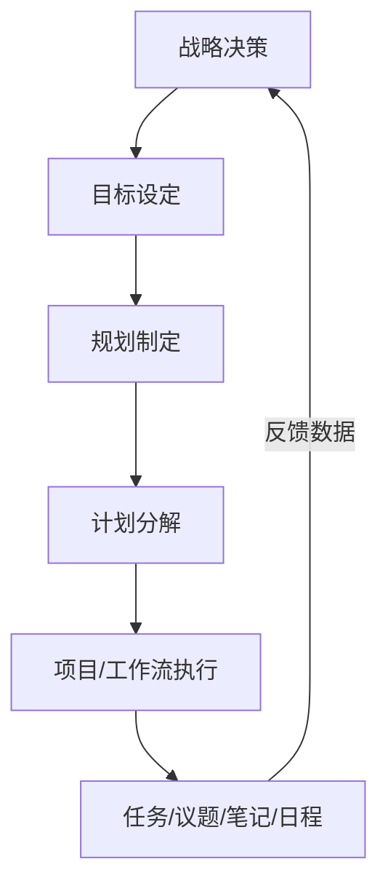
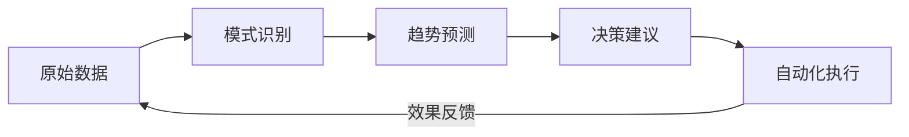
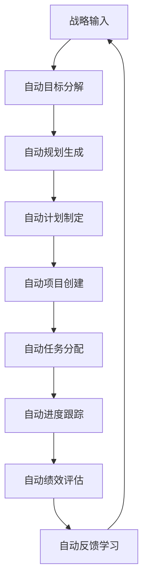
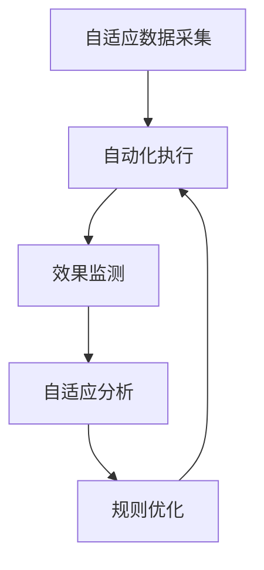

# 8-双循环管理-自适应与自动化机制原理性论述

## 引言：从自适应到自动化的自然演进

在深入解析双循环管理架构的自适应体系后，我们自然面临一个关键问题：**如何将自适应能力转化为自动化执行能力**。正如用户敏锐指出的，双循环架构天生具备自适应性，这为自动化实现提供了理想的基础条件。本文档将系统论述在双循环架构和自适应体系基础上，自动化机制的实现原理与可行性。

## 一、双循环架构对自动化的天然支持

### 1.1 结构化的决策路径

双循环架构通过**战略→目标→规划→计划→项目/工作流**的清晰路径，为自动化决策提供了结构化的输入：



这种结构化的决策链使得自动化系统能够：
- **明确决策边界**：每个环节都有清晰的输入输出规范
- **建立规则引擎**：基于历史数据和最佳实践建立决策规则
- **实现条件触发**：当满足特定条件时自动启动下一环节

### 1.2 标准化的数据接口

双循环架构中各模块间的标准化交互为自动化提供了数据基础：

- **管理模块**：输出标准化的战略指令和目标要求
- **运行模块**：提供标准化的执行状态和进度数据
- **绩效模块**：生成标准化的评估指标和反馈信息

## 二、自适应体系为自动化提供的核心基础

### 2.1 实时数据采集网络

自适应体系的"探针"机制构建了完整的数据采集网络：

| 探针类型 | 采集内容 | 自动化应用 |
|---------|---------|-----------|
| 任务状态探针 | 完成率、耗时、质量 | 自动调整资源分配 |
| 议题热度探针 | 关注度、参与度、解决率 | 自动升级优先级 |
| 笔记关联探针 | 知识关联度、复用频率 | 自动推荐相关知识 |
| 日程冲突探针 | 时间冲突、资源冲突 | 自动协调时间安排 |

### 2.2 智能分析引擎

自适应体系的分析层为自动化决策提供智能支持：



### 2.3 动态调节机制

自适应体系的调节层为自动化提供了执行通道：
- **参数调节**：自动调整工作流参数、资源分配比例
- **规则优化**：基于效果反馈自动优化决策规则
- **流程重构**：当现有流程效率低下时自动建议重构

## 三、自动化机制的核心实现原理

### 3.1 条件-动作规则引擎

基于双循环架构的标准化接口，建立条件-动作规则库：

```javascript
// 示例：目标达成度自动评估规则
{
  condition: "项目进度 > 80% && 质量评分 > 90",
  action: "自动触发下一阶段目标制定",
  priority: "高",
  feedback: "记录成功模式用于未来决策"
}

// 示例：资源冲突自动协调规则  
{
  condition: "多个任务同时请求同一资源",
  action: "基于优先级自动分配资源",
  priority: "紧急",
  feedback: "记录冲突解决效果"
}
```

### 3.2 机器学习驱动的决策优化

利用自适应体系积累的历史数据，建立机器学习模型：

**监督学习应用**：
- 基于历史成功案例训练项目成功率预测模型
- 基于团队成员表现数据训练任务分配优化模型
- 基于时间利用数据训练日程安排优化模型

**强化学习应用**：
- 通过试错学习最优的资源分配策略
- 自动探索最高效的工作流程组合
- 动态调整决策规则以获得最佳整体效果

### 3.3 工作流自动化引擎

在项目和工作流层面实现端到端自动化：



## 四、自动化机制的具体实现层次

### 4.1 基础自动化层（已具备条件）

**当前即可实现的自动化功能**：
- 任务状态自动跟踪和报告
- 日程冲突自动检测和提醒
- 文档版本自动管理和备份
- 基础数据统计和报表生成

### 4.2 智能自动化层（需要算法支持）

**基于机器学习的自动化功能**：
- 智能任务分配和资源调度
- 风险预测和自动预警
- 绩效趋势分析和改进建议
- 知识自动关联和推荐

### 4.3 认知自动化层（未来发展方向）

**高级认知自动化功能**：
- 战略目标自动分解和路径规划
- 跨部门协作自动协调
- 组织能力自动评估和发展规划
- 创新机会自动识别和评估

## 五、自动化与自适应的协同机制

### 5.1 闭环优化系统

自动化与自适应形成完美的闭环优化：



### 5.2 风险控制机制

为确保自动化系统的安全性，建立多层风险控制：

**事前控制**：
- 自动化决策边界设定
- 关键决策的人工审核机制
- 异常模式检测和阻断

**事中控制**：
- 实时效果监测和预警
- 自动化程度动态调整
- 紧急情况手动接管

**事后控制**：
- 自动化效果评估
- 错误决策追溯和学习
- 规则库持续优化

## 六、自动化实现的可行性分析

### 6.1 技术可行性

**现有技术成熟度**：
- 规则引擎技术：✅ 高度成熟
- 机器学习框架：✅ 广泛可用
- 工作流引擎：✅ 标准化产品
- 实时数据处理：✅ 技术完备

### 6.2 架构可行性

**双循环架构的天然优势**：
- 模块化设计：便于分阶段实施自动化
- 标准化接口：减少集成复杂度
- 分层结构：支持渐进式自动化
- 反馈机制：确保自动化效果可测量

### 6.3 组织可行性

**渐进式实施路径**：
1. **试点阶段**：在单个部门实施基础自动化
2. **扩展阶段**：逐步推广到其他部门
3. **集成阶段**：实现跨部门自动化协作
4. **优化阶段**：引入智能算法持续优化

## 七、自动化机制的价值体现

### 7.1 效率提升

- **决策效率**：自动化处理常规决策，释放管理精力
- **执行效率**：减少人工协调环节，加速流程运转
- **学习效率**：自动积累组织知识，加速能力建设

### 7.2 质量改善

- **决策质量**：基于数据驱动的自动化决策更加客观
- **执行质量**：标准化流程减少人为误差
- **服务质量**：快速响应变化，提升客户满意度

### 7.3 创新能力

- **探索能力**：自动化系统可以尝试更多创新路径
- **适应能力**：快速适应外部环境变化
- **进化能力**：通过持续学习不断优化自身

## 结论：自动化是双循环架构的自然延伸

通过对双循环管理架构的深入分析，我们可以明确得出结论：**自动化不是外部附加的功能，而是双循环架构内在能力的自然延伸和必然发展**。

### 核心论证要点：

1. **架构基础坚实**：双循环架构的结构化决策路径和标准化接口为自动化提供了理想的基础设施
2. **数据支撑完备**：自适应体系构建的实时数据网络为自动化决策提供了充分的信息支持
3. **技术路径清晰**：从规则引擎到机器学习，技术栈成熟且可渐进实施
4. **价值体现明确**：自动化将显著提升组织效率、质量和创新能力

### 实施建议：

**短期重点**：优先实现基础自动化功能，快速获得效益
**中期目标**：引入智能算法，提升自动化决策质量
**长期愿景**：构建完整的认知自动化系统，实现组织智能的持续进化

双循环管理架构不仅为当前的组织管理提供了有效框架，更为未来的自动化智能管理铺平了道路。这种从自适应到自动化的自然演进，体现了该架构的前瞻性和可持续发展能力。