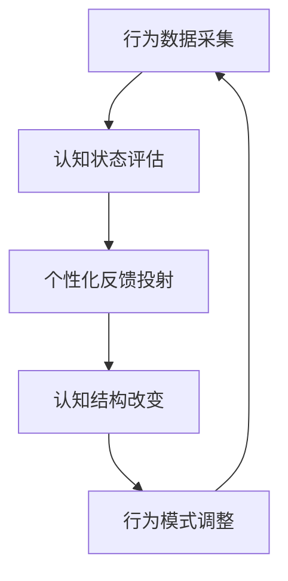
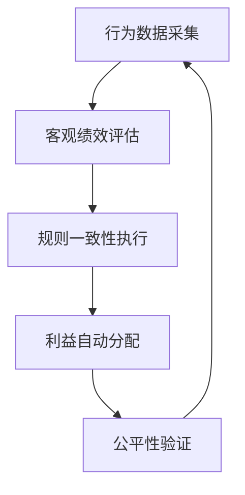

# 9-双循环管理-人的自动化管理机制原理性论述

## 引言：从系统自动化到人的自动化

在前两部分中，我们深入论述了双循环管理架构的核心机制以及在此基础上实现的自适应与自动化体系。现在，我们进入最具价值但也最具挑战性的第三部分：**实现对人的自动化管理**。这一机制的核心在于通过行为采集、认知评估和反馈投射，形成"认知改变→行为调整"的闭环，最终实现对人的全自动管理。

## 一、人的自动化管理核心机制

### 1.1 认知-行为闭环原理

人的自动化管理建立在以下核心闭环上：



这个闭环的关键在于**可预测的反应**：基于个人特有的认知水平和结构，对特定类型的反馈信息会产生相对稳定的行为反应。

### 1.2 三级投射机制

为实现有效的认知改变，需要建立三级投射机制：

**一级投射：即时行为反馈**
- 通过任务完成情况、日程遵守度等即时数据
- 提供简单的成功/失败反馈
- 影响表面的行为习惯

**二级投射：模式识别反馈**
- 分析行为模式（如决策风格、协作倾向）
- 提供模式优化建议
- 影响中层的认知框架

**三级投射：价值观塑造反馈**
- 基于长期行为数据推断价值观取向
- 提供价值观层面的引导
- 影响深层的认知结构

## 二、在双循环架构中的实现基础

### 2.1 行为数据采集网络

双循环架构天然提供了丰富的行为数据源：

| 数据来源 | 采集内容 | 认知推断价值 |
|---------|---------|-------------|
| 任务系统 | 完成质量、时效性、协作度 | 执行力、责任心、专业能力 |
| 议题讨论 | 参与深度、观点质量、解决贡献 | 批判思维、创新能力、知识广度 |
| 笔记系统 | 记录频率、知识关联、复用模式 | 学习能力、知识管理、思维模式 |
| 日程管理 | 时间规划、优先级安排、冲突处理 | 时间观念、计划能力、应变能力 |

### 2.2 认知评估模型

基于采集的行为数据，建立多维认知评估模型：

```javascript
// 示例：认知评估维度
const cognitiveDimensions = {
  executiveAbility: { // 执行能力
    indicators: ["taskCompletionRate", "timeEfficiency", "qualityScore"],
    weight: 0.3
  },
  decisionMaking: { // 决策能力
    indicators: ["issueResolutionRate", "decisionQuality", "riskAssessment"],
    weight: 0.25
  },
  learningCapacity: { // 学习能力
    indicators: ["knowledgeAcquisition", "skillImprovement", "adaptability"],
    weight: 0.2
  },
  collaboration: { // 协作能力
    indicators: ["teamContribution", "communicationEffectiveness", "conflictResolution"],
    weight: 0.25
  }
};
```

### 2.3 反馈投射通道

利用双循环架构的标准化接口实现精准反馈投射：

- **管理模块通道**：通过目标调整、规划建议影响战略认知
- **运行模块通道**：通过任务分配、流程优化影响执行认知
- **绩效模块通道**：通过评估反馈、发展建议影响自我认知

## 三、可行性难点深度分析

### 3.1 技术实现难点

#### 难点一：认知状态准确推断

**挑战**：
- 行为与认知的非线性关系
- 个体差异导致的模型泛化困难
- 环境因素对行为的影响难以剥离

**解决方案路径**：
- 建立个性化基线模型，长期跟踪校准
- 采用多模态数据融合（行为、文本、社交）
- 引入上下文感知的评估算法

#### 难点二：反馈投射精准度

**挑战**：
- 反馈信息如何准确匹配认知接收模式
- 避免认知失调或心理抗拒
- 平衡即时反馈与长期引导

**解决方案路径**：
- 基于认知风格测试建立个性化反馈模板
- 采用渐进式反馈策略，从小改变开始
- 建立反馈效果A/B测试机制

#### 难点三：闭环稳定性

**挑战**：
- 认知改变的滞后性和不确定性
- 外部因素干扰导致预测失效
- 系统过度干预引发反效果

**解决方案路径**：
- 建立动态调节机制，实时优化干预强度
- 设置安全边界，防止过度自动化
- 引入人工监督节点，处理异常情况

### 3.2 心理伦理难点

#### 难点四：个人自主权保护

**挑战**：
- 自动化管理可能被视为操纵或控制
- 个人选择权与系统推荐的冲突
- 认知改变的伦理边界

**应对策略**：
- 透明化机制：明确告知数据使用和反馈目的
- 选择退出权：提供不同级别的参与选项
- 价值对齐：确保系统目标与个人发展目标一致

#### 难点五：隐私与数据安全

**挑战**：
- 行为数据的敏感性
- 认知评估结果的潜在滥用
- 数据泄露的心理影响

**应对策略**：
- 数据最小化原则：只收集必要数据
- 匿名化处理：脱敏后进行分析
- 严格权限控制：限制数据访问范围

### 3.3 组织文化难点

#### 难点六：接受度与信任建立

**挑战**：
- 员工对"被管理"的抵触心理
- 对算法决策的信任缺失
- 传统文化与管理模式的冲突

**应对策略**：
- 渐进式引入：从辅助工具开始，逐步深化
- 成效可视化：明确展示个人获益
- 参与式设计：让员工参与系统优化

#### 难点七：公平性与偏见控制

**挑战**：
- 算法可能放大现有偏见
- 不同群体的适应性差异
- 评估标准的主观性

**应对策略**：
- 多样性训练数据：确保模型代表性
- 定期偏见审计：检测和纠正偏差
- 多维度评估：避免单一标准判断

## 四、核心运行机制深度解析

### 4.1 认知映射与建模

建立个人认知地图的关键技术：


### 4.2 个性化反馈算法

基于认知模型的反馈生成机制：

```javascript
class PersonalizedFeedbackEngine {
  constructor(userCognitiveModel) {
    this.cognitiveModel = userCognitiveModel;
    this.feedbackTemplates = this.loadTemplates();
  }
  
  generateFeedback(behaviorData, context) {
    // 分析行为偏离预期程度
    const deviation = this.analyzeDeviation(behaviorData);
    
    // 根据认知风格选择反馈方式
    const feedbackStyle = this.selectFeedbackStyle();
    
    // 生成个性化反馈内容
    return this.assembleFeedback(deviation, feedbackStyle, context);
  }
  
  selectFeedbackStyle() {
    const { learningStyle, motivationType, resistanceLevel } = this.cognitiveModel;
    
    if (learningStyle === 'visual') return 'diagrammatic';
    if (motivationType === 'intrinsic') return 'questioning';
    if (resistanceLevel > 0.7) return 'suggestive';
    
    return 'directive';
  }
}
```

### 4.3 动态调节机制

确保系统自适应性的关键设计：

**调节参数**：
- 干预强度：基于接受度和效果动态调整
- 反馈频率：根据改变速率优化
- 内容深度：匹配当前认知水平

**调节逻辑**：
```
IF 反馈接受度 > 阈值 AND 行为改变率 > 期望值 THEN
    增加干预强度
ELSE IF 心理抗拒度 > 阈值 THEN
    降低干预强度，改变反馈方式
ELSE
    维持当前参数
END IF
```

## 五、在双循环架构中的集成方案

### 5.1 与现有模块的融合

**管理模块集成**：
- 战略目标分解时考虑团队认知能力
- 规划制定时融入个人发展路径
- 目标调整基于认知成长进度

**运行模块集成**：
- 任务分配优化基于能力认知匹配
- 工作流设计考虑认知负荷分布
- 协作模式推荐基于社交认知特征

**绩效模块集成**：
- 评估标准包含认知成长指标
- 反馈机制与认知投射系统联动
- 发展计划个性化基于认知分析

### 5.2 分层实施路径

**第一阶段：辅助决策（1-2年）**
- 行为数据采集和分析
- 认知评估报告生成
- 人工决策辅助建议

**第二阶段：智能推荐（2-3年）**
- 自动化反馈生成
- 个性化发展路径推荐
- 半自动化的管理干预

**第三阶段：闭环管理（3-5年）**
- 完整的认知-行为闭环
- 自适应调节机制
- 全自动化的个人发展管理

## 六、政治学视角下的自动化管理机制

### 6.1 政治学方法论的核心挑战

政治学作为利益分配和规则制定的科学，在传统人管人系统中面临两大核心挑战：

**公平性难题**：
- 人为利益分配易受偏见、关系和权力影响
- 规则执行的一致性难以保证
- 绩效评估的主观性导致争议

**完备性难题**：
- 规则制定难以覆盖所有场景
- 执行过程中的变通和例外破坏系统性
- 监督机制本身可能被腐蚀

### 6.2 自动化机制对政治学难题的天然解决

双循环架构的自动化机制恰好弥补了这些政治学难题：

#### 6.2.1 公平性的自动化保障



**关键机制**：
- **非人管理者**：自动化系统不受情感、关系影响，确保利益分配基于客观数据
- **规则透明化**：所有决策规则公开可查，减少人为操纵空间
- **实时监督**：系统自动监测规则执行偏差，即时纠正

#### 6.2.2 完备性的系统化实现

**数据驱动的规则完善**：
- 基于双循环架构的全面数据采集，识别规则盲点
- 通过自适应学习不断优化规则体系
- 异常情况自动记录并触发规则更新

**执行一致性的技术保障**：
- 工作流引擎确保规则在各级部门一致执行
- 自动化审计跟踪所有决策过程
- 动态调节机制维护系统完整性

### 6.3 利益分配的科学化变革

#### 6.3.1 从主观判断到客观算法

传统利益分配模式：
```
人为主观评估 → 模糊标准 → 争议频发 → 信任损耗
```

自动化利益分配模式：
```
客观数据采集 → 明确算法规则 → 透明执行 → 信任建立
```

#### 6.3.2 绩效判定的革命性改进

**传统判定的局限性**：
- 评估者认知偏差
- 信息不对称
- 短期表现偏好
- 人际关系影响

**自动化判定的优势**：
- 全周期行为跟踪
- 多维度客观指标
- 长期趋势分析
- 跨部门公平比较

### 6.4 规则演化的民主化机制

#### 6.4.1 数据驱动的规则优化

```javascript
// 示例：规则演化算法
class RuleEvolution {
  constructor() {
    this.ruleBase = this.loadRules();
    this.effectMetrics = this.defineMetrics();
  }
  
  optimizeRules(performanceData, feedbackData) {
    // 分析规则执行效果
    const ruleEffectiveness = this.analyzeEffectiveness(performanceData);
    
    // 基于反馈调整规则
    const updatedRules = this.adjustRules(ruleEffectiveness, feedbackData);
    
    // 测试新规则效果
    return this.testNewRules(updatedRules);
  }
}
```

#### 6.4.2 参与式规则制定

- **数据透明**：所有成员可查看影响自己的数据
- **规则建议**：基于数据异常提出规则改进建议
- **效果验证**：新规则实施前后的效果对比分析

## 七、价值与风险平衡

### 7.1 潜在价值

**政治学价值突破**：
- 利益分配公平性的本质改善
- 规则执行完备性的系统保障
- 组织信任度的根本提升

**组织层面**：
- 人力资源配置最优化
- 团队能力持续提升
- 管理决策科学化
- 组织学习加速度

**个人层面**：
- 个性化成长路径
- 及时的能力发展反馈
- 工作匹配度提升
- 职业发展清晰化

### 7.2 风险控制框架

**政治风险控制**：
- 权力过度集中预防机制
- 规则偏向性检测算法
- 利益相关方平衡保障

**技术风险控制**：
- 建立模型准确度监控
- 设置系统回滚机制
- 定期第三方审计

**伦理风险控制**：
- 伦理审查委员会监督
- 员工代表参与设计
- 透明化运作机制

**运营风险控制**：
- 渐进式推广策略
- 多场景测试验证
- 持续的效果评估

## 结论：人的自动化管理的可行性与前景

通过对人的自动化管理机制的深度分析，我们可以得出以下结论：

### 核心可行性论证：

1. **理论基础坚实**：认知心理学、行为经济学为机制设计提供了科学依据
2. **数据基础完备**：双循环架构天然提供了丰富的行为数据源
3. **技术路径清晰**：从机器学习到个性化推荐，技术栈逐步成熟
4. **价值诉求明确**：组织和个人都有提升管理效率和发展质量的需求

### 关键成功要素：

- **渐进式实施**：从辅助到推荐再到自动化，分阶段推进
- **多方参与**：技术专家、心理学家、伦理学家、员工代表共同设计
- **持续优化**：基于实际效果不断调整和改进机制
- **伦理先行**：在技术实现前建立完善的伦理框架

### 最终展望：

人的自动化管理代表了组织管理演进的终极方向——从管理流程到管理系统，最终管理人的认知和发展。双循环架构为此提供了理想的实现平台，而我们在前两部分论述的自适应和自动化机制则为这一目标奠定了坚实的技术基础。

虽然面临诸多技术和伦理挑战，但通过科学的方***谨慎的实施策略，这一愿景完全有可能在未来的组织管理中变为现实，最终实现组织与个人的协同进化与共同成长。