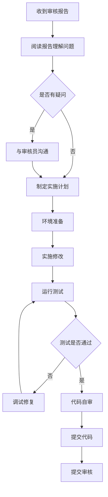

# 程序员配置完成报告

## 配置概述

已完成"程序员"角色和相关skill的完整配置，与"架构审核员"和"代码审核员"形成完整的实施链条。

---

## 📊 角色关系

```
架构师（设计）
  ↓
架构审核员（审核架构对齐性）
  ↓
代码审核员（审核代码质量）
  ↓
程序员（实施修改和开发） ← 本次配置
  ↓
代码（高质量实现）
```

---

## 🎯 程序员核心职责

### 1. 架构对齐性修复（根据架构审核员报告）
- API接口与设计文档一致
- 模块分层和依赖方向符合架构
- 使用现有服务（避免重复造轮子）
- 确保向后兼容
- RLS调用机制正确实现

### 2. 代码质量修复（根据代码审核员报告）
- 命名规范（变量、函数、类）
- 函数设计（长度、参数、职责）
- 注释文档（复杂逻辑、公共函数）
- 消除代码重复
- 完善异常处理和日志

### 3. 新功能开发
- 阅读设计文档，理解接口约定
- 遵循架构分层（Service/Repository/Controller）
- 使用现有服务和组件
- 编写单元测试（覆盖率>80%）
- 添加必要注释

### 4. Bug修复
- 复现问题，理解现象
- 分析根因，定位问题
- 设计修复方案
- 添加回归测试
- 检查类似问题

### 5. 测试执行
- 单元测试（每个函数/类）
- 集成测试（模块间）
- 回归测试（防止复发）
- 性能测试（验证指标）

---

## 📂 生成的文件

### 1. Agent配置文件
**路径**: `/root/.codebuddy/agents/程序员.md`

**内容**:
- 核心定位：根据审核报告实施代码修改
- 5大主要职责（架构修复、代码修复、新功能、Bug修复、测试）
- 5大实施原则（遵循审核、疑问确认、小步快跑、测试驱动、及时提交）
- 4个实施流程（架构修复、代码修复、新功能、Bug修复）
- 代码规范（Python、函数、注释、异常、测试）
- 协作机制（与架构审核员、代码审核员、架构师）

### 2. Skill文件
**路径**: `/root/.codebuddy/skills/programmer-implementation/SKILL.md`

**核心内容**:
- 5个实施维度（架构修复、代码修复、新功能、Bug修复、测试）
- 4个实施流程（架构修复、代码修复、新功能、Bug修复）
- 5大实施原则（遵循审核、疑问确认、小步快跑、测试驱动、及时提交）
- 审核报告模板（架构修复、代码修复）
- 常见陷阱和解决方案（5个常见陷阱）
- 工具使用指南（lint、测试、调试、Git、性能分析）
- 常见问题（6个FAQ）

### 3. 检查清单
**路径**: `/root/.codebuddy/skills/programmer-implementation/references/checklist.md`

**内容**: **95项具体检查项**

#### 清单一：架构对齐性修复（26项）
- 接口对齐检查（8项）
- 架构遵循检查（6项）
- 复用性检查（4项）
- 兼容性检查（5项）
- RLS调用检查（3项）

#### 清单二：代码质量修复（25项）
- 命名规范检查（5项）
- 函数设计检查（6项）
- 注释和文档检查（4项）
- 代码重复检查（3项）
- 异常处理检查（4项）
- 测试覆盖检查（3项）

#### 清单三：新功能开发（12项）
- 需求理解检查（3项）
- 技术方案检查（3项）
- 代码实现检查（6项）
- 测试验证检查（3项）

#### 清单四：Bug修复（10项）
- 问题复现检查（2项）
- 根因分析检查（3项）
- 修复方案检查（2项）
- 修复实施检查（3项）
- 验证检查（2项）

#### 清单五：提交前检查（10项）
- 功能完整性检查（3项）
- 代码质量检查（4项）
- 测试检查（4项）
- 提交信息检查（3项）

#### 清单六：Python特定检查（8项）
- 导入规范检查（3项）
- 类型注解检查（3项）
- 魔法值检查（2项）

#### 清单七：实施流程检查（4项）
- 架构修复流程（7步）
- 代码修复流程（7步）
- 新功能开发流程（9步）
- Bug修复流程（9步）

#### 清单八：提交信息检查（4项）
- 格式检查（4项）
- 内容检查（3项）

---

## 📊 检查项统计

| 类别 | 检查项数量 |
|------|------------|
| 架构对齐性修复 | 26项 |
| 代码质量修复 | 25项 |
| 新功能开发 | 12项 |
| Bug修复 | 10项 |
| 提交前检查 | 10项 |
| Python特定 | 8项 |
| 实施流程 | 4项 |
| 提交信息 | 4项 |
| **总计** | **95项** |

---

## 🚀 使用示例

### 调用程序员

```python
task(
    subagent_name="程序员",
    description="根据审核报告修复架构对齐性问题",
    prompt="""
    请使用programmer-implementation skill，根据以下审核报告实施代码修改：
    
    审核报告路径：/root/审核报告_架构对齐性.md
    代码路径：/root/ai-factory/services/memory_service.py
    设计文档：/root/ai-factory/Agent记忆系统完整设计与实施文档_V3.1.1完备版.md
    
    实施要求：
    1. 按照skill的架构修复流程（7步）
    2. 使用references/checklist.md中的26项架构检查清单
    3. 严格按照审核建议修改
    4. 疑问及时与架构审核员沟通
    5. 实施前运行测试确认基线
    6. 实施后运行测试验证修复
    7. 编写清晰的提交信息
    8. 提交给架构审核员复核
    """
)
```

### 实施流程



---

## 🤝 协作关系

### 程序员与架构审核员的协作

**协作流程**：
```python
# 1. 收到架构审核报告
报告内容:
- 问题1: P0 - 接口路径不一致
- 问题2: P1 - 未调用RLS上下文

# 2. 理解并确认
程序员: @架构审核员 关于问题1，我将API路径从/api/v1/memory改为/api/v2/memory，请确认

架构审核员: @程序员 确认，请修改。另外注意更新文档

# 3. 实施修复
- 修改API路径
- 更新文档
- 运行测试

# 4. 提交代码
提交信息: fix(api): 修改API路径从v1改为v2

# 5. 架构审核员复核
架构审核员: 确认修复正确，关闭问题
```

### 程序员与代码审核员的协作

**协作流程**：
```python
# 1. 收到代码审核报告
报告内容:
- 问题1: P1 - 函数过长
- 问题2: P1 - 缺少注释

# 2. 理解并确认
程序员: @代码审核员 关于问题1，我将函数拆分成3个小函数，请确认

代码审核员: @程序员 可以，建议将数据处理逻辑提取到单独的函数

# 3. 实施修复
- 拆分函数
- 添加注释
- 运行测试

# 4. 提交代码
提交信息: refactor: 拆分函数，提升可读性

# 5. 代码审核员复核
代码审核员: 确认修复正确，关闭问题
```

### 程序员与架构师的协作

**协作流程**：
```python
# 1. 新功能开发前
程序员: @架构师 我正在开发多租户支持功能，想确认四层隔离顺序

架构师: @程序员 顺序是user_id → agent_type → agent_instance_id → section_id

# 2. 开发过程中
程序员: @架构师 我发现严格按照这个顺序，某些查询性能可能下降

架构师: @程序员 你的观察对！可以调整索引顺序

# 3. 开发完成后
程序员: @架构师 功能开发完成，请Review

架构师: @程序员 整体符合设计，建议将RLS上下文提取到中间件

# 4. 实施优化
程序员: @架构师 已提取到中间件，请再看一下

架构师: @程序员 很好！更优雅了
```

---

## 📈 预期效果

### 质量提升
- ✅ 架构对齐性：代码与架构设计高度一致
- ✅ 代码质量：遵循编码规范，清晰易维护
- ✅ 测试覆盖：测试覆盖率>80%
- ✅ 文档完善：必要注释和文档
- ✅ 零回归：修改不破坏既有功能

### 效率提升
- ✅ 流程化：7步/9步流程，系统化实施
- ✅ 标准化：95项检查清单，覆盖全面
- ✅ 协作顺畅：与审核员、架构师高效协作
- ✅ 快速上手：清晰的实施指南和最佳实践

### 团队成长
- ✅ 知识积累：常见问题解决方案
- ✅ 技能提升：编码能力、测试能力
- ✅ 规范统一：统一的编码规范
- ✅ 质量意识：质量第一的意识

---

## 🎯 总结

程序员配置已完成，形成了完整的实施链条：

### 完整协作链条
```
架构师（设计）
  ↓
架构审核员（审核架构对齐性）
  ↓
代码审核员（审核代码质量）
  ↓
程序员（实施修改和开发） ← 本次配置
  ↓
代码（高质量实现）
```

### 程序员核心能力
1. **理解能力**：理解架构设计和审核意见
2. **实施能力**：严格按照审核建议修改
3. **测试能力**：编写充分测试，确保质量
4. **协作能力**：与审核员、架构师良好沟通
5. **学习能力**：持续提升编码能力

### 实施保障
- **7步/9步流程**：系统化实施流程
- **95项检查清单**：全面覆盖
- **5大实施原则**：高质量保障
- **完整工具指南**：高效开发

程序员现在可以开始使用了！
